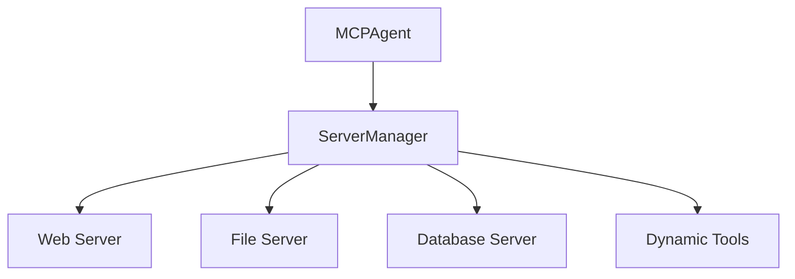
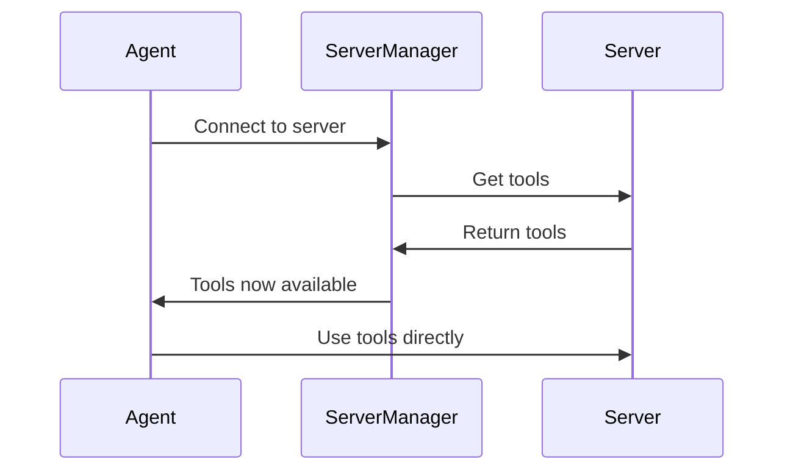

Server Manager is an agent mode for multi-server setups. Instead of exposing every tool from every server at initialization, the agent starts with management tools and connects to individual servers when the task needs them.

Use Server Manager when you connect to several servers or when the combined tool list is too large for the model context. For one or two small servers, the normal agent mode is usually simpler.

## How it changes initialization



With `useServerManager: true`, the agent receives management tools first. When the agent connects to a server, the available tool set changes and the agent executor is recreated with the newly loaded tools.



## Enable Server Manager

Pass `useServerManager: true` when constructing the agent. Explicit mode requires a client because Server Manager coordinates configured client servers.

<CodeGroup>
```typescript TypeScript
import { MCPClient, MCPAgent } from 'mcp-use'
import { ChatOpenAI } from '@langchain/openai'

const client = new MCPClient({
  mcpServers: {
    playwright: {
      command: 'npx',
      args: ['@playwright/mcp@latest']
    },
    filesystem: {
      command: 'npx',
      args: ['-y', '@modelcontextprotocol/server-filesystem', '/tmp']
    }
  }
})

const agent = new MCPAgent({
  llm: new ChatOpenAI({ model: 'gpt-4o' }),
  client,
  useServerManager: true
})

const result = await agent.run({
  prompt: 'Use the right server to inspect /tmp and summarize what you find.',
  maxSteps: 12
})

console.log(result)
await agent.close()
```
</CodeGroup>

## Management tools

The agent uses these management tools before it can call tools from a configured MCP server.

| Tool | What it does |
| --- | --- |
| `list_mcp_servers` | Lists configured servers and their known capabilities. |
| `connect_to_mcp_server` | Connects to one server and loads its tools. |
| `get_active_mcp_server` | Reports the currently active server. |
| `disconnect_from_mcp_server` | Disconnects the active server and removes its tools. |
| `add_mcp_server_from_config` | Adds a server from configuration during the run. |

## Prompt for server discovery

Ask the agent to inspect available servers before choosing one. This helps when server names are not obvious from the user request.

```typescript
import { MCPClient, MCPAgent } from 'mcp-use'
import { ChatOpenAI } from '@langchain/openai'

async function demoServerManager() {
  const client = new MCPClient({
    mcpServers: {
      web: { command: 'npx', args: ['@playwright/mcp@latest'] },
      files: {
        command: 'npx',
        args: ['-y', '@modelcontextprotocol/server-filesystem', '/tmp']
      }
    }
  })

  const agent = new MCPAgent({
    llm: new ChatOpenAI({ model: 'gpt-4o' }),
    client,
    useServerManager: true,
    verbose: true
  })

  const result = await agent.run({
    prompt: `
      First list the available MCP servers.
      Then choose the right server to inspect /tmp.
      Summarize what you found and mention which server you connected to.
    `,
    maxSteps: 12
  })

  console.log(result)
  await agent.close()
}

demoServerManager().catch(console.error)
```

## When not to use it

Do not enable Server Manager just to connect to a single server. It adds an extra discovery step and makes the model choose a server before it can use tools. For small setups, expose all tools directly and rely on `disallowedTools`, `exposeResourcesAsTools`, and `exposePromptsAsTools` to control scope.
