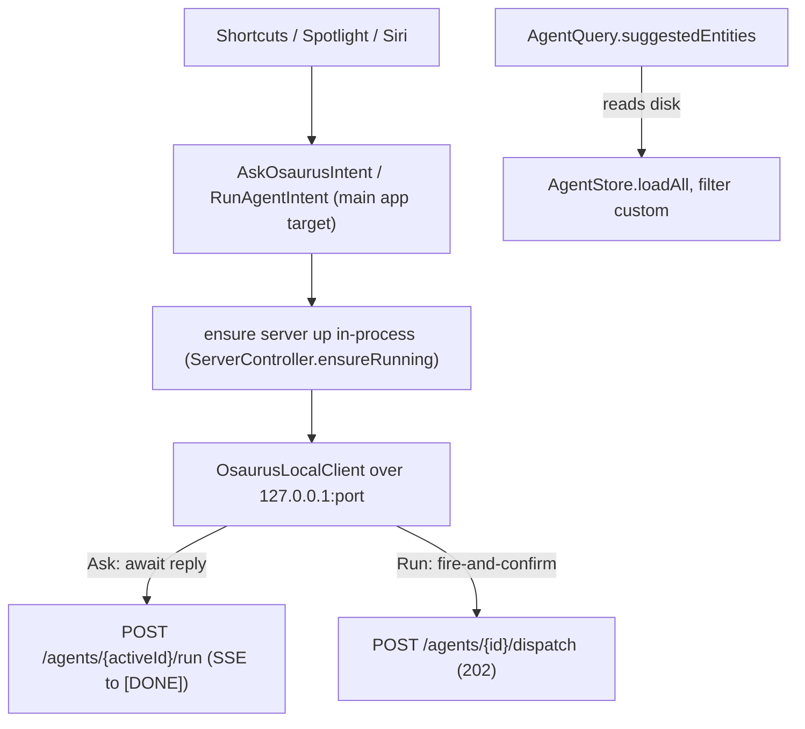

# App Intents (Shortcuts, Spotlight, Siri)

This guide explains how Osaurus exposes itself to the system through Apple's
App Intents framework, so it can be driven from Shortcuts, Spotlight, and Siri.

- **Audience**: Osaurus developers and power users.
- **Scope**: This is the **provider** direction only (the OS asks Osaurus to do
  something). Osaurus calling *other* apps' intents is out of scope.

---

## What you get

Two app shortcuts are available the moment Osaurus is installed — no setup:

| Shortcut | Intent | Behavior |
|----------|--------|----------|
| **Ask Osaurus** | `AskOsaurusIntent` | Sends a prompt to the **currently active** agent (`AgentManager.activeAgentId`) and returns/speaks the reply. Awaits the result. |
| **Run Osaurus Agent** | `RunAgentIntent` | Starts one of your custom agents in the background (fire-and-confirm). Progress and results surface in Osaurus's own Work Mode and toasts. |

Example phrases (each must contain the app name):

- "Ask Osaurus" → then dictate/type the prompt
- "Run <agent> in Osaurus"

---

## Central invariant

**Intents are thin clients.** Every intent does its work by calling the
existing local HTTP server over `127.0.0.1`. Intents load no models, open no
databases, and hold no orchestration logic. This is the same contract the
in-app chat, the iOS companion, and the Web UI use, so there is no
App Intents-specific bridge to maintain.



---

## Architecture

### Where the code lives

Everything is in the **main app target** (`App/osaurus/AppIntents/`), not a
separate App Intents extension:

| File | Role |
|------|------|
| `App/osaurus/AppIntents/AgentEntity.swift` | `AgentEntity` + `AgentQuery` (the agent picker) |
| `App/osaurus/AppIntents/OsaurusIntents.swift` | `AskOsaurusIntent`, `RunAgentIntent` |
| `App/osaurus/AppIntents/OsaurusShortcuts.swift` | `OsaurusShortcuts` (the `AppShortcutsProvider`) |
| `Packages/OsaurusCore/AppIntents/OsaurusLocalClient.swift` | The shared HTTP client + server-up logic |

The client lives in `OsaurusCore` (reusable, testable); the App Intents types
live in the app target because `AppShortcutsProvider` discovery and the
App Intents metadata extractor operate on the app bundle.

The app is **unsandboxed** (`ENABLE_APP_SANDBOX = NO`), so the intent code
reads `~/.osaurus/` directly and starts the server in-process. There is no app
group and no shared snapshot file — the live source of truth is read directly.

### Execution endpoints

| Intent | Endpoint | Why |
|--------|----------|-----|
| Ask Osaurus | `POST /agents/{activeId}/run` | The full agent loop (persona, memory, skills, tools) on the currently active agent. Streams SSE; the client reads to the `[DONE]` frame and concatenates `choices[].delta.content`. Short asks finish well within the intent time budget. |
| Run Osaurus Agent | `POST /agents/{id}/dispatch` | A **detached** background run that survives the client disconnecting. Returns `202` immediately with a `poll_url`; the run continues in the app. |

`POST /agents/{id}/run` is a streaming, **connection-bound** loop (capped at 30
tool iterations). If the client disconnects, the run is cancelled. That is fine
for a short "ask" but wrong for a long, tool-heavy run — which is exactly why
`RunAgentIntent` uses the detached `/dispatch` path instead of awaiting.

### The agent picker

`AgentQuery` reads `AgentStore.loadAll()` on the main actor and filters to
**custom** agents (mirroring `GET /agents`, which also omits built-ins). The
built-in "Osaurus" agent is intentionally excluded from the picker — "Ask
Osaurus" targets the active agent instead. `AgentQuery` also conforms to
`EntityStringQuery` so Siri and Spotlight can match agents by name.

Because picker population reads from disk, it works even when the server isn't
running.

### Server-up path

Before any request, `OsaurusLocalClient.ensureServerReachable()`:

1. Resolves the base URL — live config (`ServerController.sharedConfiguration`),
   then `~/.osaurus/config/server.json`, then the default port `1337`.
2. `GET /health`. If healthy, proceed.
3. Otherwise calls `ServerController.ensureRunning()` (starts the embedded
   server in-process on the live controller) and retries with short backoff
   (~2s) before throwing a readable `serverUnreachable` error.

Since the intents run inside the app's own process, the system launches the
menu-bar app to handle them, and the server is brought up headlessly.

### The built-in agent over loopback

"Ask Osaurus" follows the active agent, which **defaults to the built-in
"Osaurus" agent** until the user selects a different one. By default the
built-in agent is **blocked on all HTTP surfaces** (`BuiltInAgentGuard` →
`403 built_in_agent_not_exposable`) so its persona, memory, and tools are
reachable only from the in-app Chat. So that "Ask Osaurus" works when the
built-in is the active agent, the guard is **relaxed for loopback callers only**
on `/agents/{id}/run` and `/agents/{id}/dispatch` (see `HTTPHandler.swift`).
Remote callers remain blocked.

> Security note: this exposes the built-in agent to any process on `localhost`
> without authentication, consistent with Osaurus's existing no-auth-loopback
> model. The plugin-host path that also consults the guard was **not** changed.

---

## Installing (development)

```bash
make app
# -> build/DerivedData/Build/Products/Release/osaurus.app
cp -R build/DerivedData/Build/Products/Release/osaurus.app /Applications/
open /Applications/osaurus.app
```

App Intents metadata is embedded at build time (the
`appintentsmetadataprocessor` build phase). The shortcuts appear once macOS
registers the bundle (launching it once is enough). If they look stale, it is
almost always Launch Services caching an old copy:

```bash
/System/Library/Frameworks/CoreServices.framework/Frameworks/LaunchServices.framework/Support/lsregister -f /Applications/osaurus.app
```

For end users there is nothing extra to do: installing Osaurus normally makes
the shortcuts available with zero configuration.

**Prerequisites for a meaningful run**

- A working model configured (so the built-in agent can answer "Ask Osaurus").
- At least one custom agent created in-app (so "Run Osaurus Agent" has
  something to list).

---

## Testing

### Layer 1 — HTTP path (fastest, no UI)

With the app running (server on `1337`):

```bash
# Ask path: built-in agent, reachable over loopback (the guard relaxation)
curl -N -X POST \
  http://127.0.0.1:1337/agents/00000000-0000-0000-0000-000000000001/run \
  -H 'Content-Type: application/json' \
  -d '{"model":"default","messages":[{"role":"user","content":"say hi"}],"stream":true}'
# expect: SSE delta.content chunks ending in `data: [DONE]` (NOT a 403)

# Run path: use a real custom agent id from GET /agents
curl -s http://127.0.0.1:1337/agents
curl -i -X POST http://127.0.0.1:1337/agents/<AGENT_ID>/dispatch \
  -H 'Content-Type: application/json' \
  -d '{"prompt":"summarize my latest notes"}'
# expect: 202 {"id","status":"running","poll_url":"/v1/tasks/..."}
curl http://127.0.0.1:1337/tasks/<id>   # poll status/output
```

### Layer 2 — Unit tests (guard relaxation)

```bash
OSAURUS_DISABLE_KEYCHAIN_FOR_TESTS=1 OSAURUS_TEST_ROOT=/tmp/osaurus-test \
  swift test --package-path Packages/OsaurusCore --filter builtInAgentRun
```

Covers `builtInAgentRun_overLoopback_bypassesGuard` (loopback → streams, no
403) and `builtInAgentRun_remote_isRejected` (remote → 403).

### Layer 3 — App Intents UX

- **Shortcuts app**: add "Ask Osaurus" / "Run Osaurus Agent", fill the
  parameters, run. The agent dropdown exercises `AgentQuery.suggestedEntities`.
- **Spotlight**: ⌘-Space, type "Ask Osaurus".
- **Siri**: "Ask Osaurus", or "Run <agent> in Osaurus".

Edge cases:

- Quit the app, then run a shortcut — the system launches the app and
  `ensureServerReachable()` brings the server up (first run is slightly slower).
- Stop the server in settings, then run a shortcut — it should auto-start
  rather than error; if it truly cannot reach the server you get the readable
  "Osaurus isn't reachable…" message.

---

## Implementation notes / constraints

- **No `String` in shortcut phrases.** App Shortcut phrases may only
  interpolate `AppEntity` / `AppEnum` parameters, never a plain `String`. That
  is why "Ask Osaurus" has no `\(\.$prompt)` phrase — the prompt is supplied
  through the intent parameter. The `agent` entity *can* appear in a phrase.
- **Empty input on Run.** `/dispatch` requires a non-empty prompt; if the user
  provides no input, the client falls back to a minimal `"Begin."` kickoff.
- **Request shape.** `/agents/{id}/run` takes an OpenAI-style body with a
  `messages` array (not a single `prompt`); `/dispatch` takes `{"prompt": "..."}`.

---

## Deferred (not implemented)

- `SkillEntity`, `PersonaEntity`, `RunSkillIntent` — skills and personas have no
  HTTP listing/run surface yet.
- A separate App Intents **extension** + app group snapshot (would lower
  cold-launch latency at the cost of provisioning complexity; revisit if
  launch latency becomes a problem).
- Consumer direction (calling other apps' Shortcuts/AppleScript as tools).
- Donating intents from in-app actions for Siri suggestions.
- Exposing per-agent vision capability to gate image-attachment parameters.
