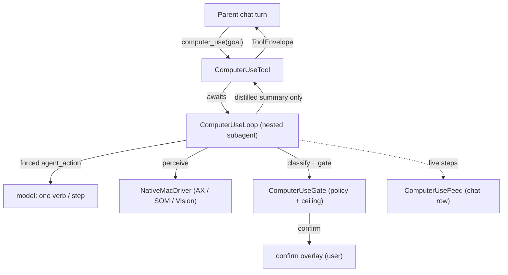

# Computer Use

Drive a real macOS app on the user's behalf to accomplish a natural-language
goal — fill a form, flip a setting, navigate an app, extract on-screen text —
working primarily from the **accessibility tree** and falling back to a
**screenshot** only when an element can't be resolved. Computer Use is
**off by default**, enabled **per agent** (custom agents only), and every
action passes through a **safe-by-default autonomy gate** before it runs.

> **Status: Experimental.** The harness, gate, perception ladder, and the
> local-first cloud-vision boundary are implemented and unit/eval covered. The
> Default agent cannot use it; only custom agents that explicitly enable it.

## Mental model

The parent agent calls one tool — `computer_use(goal:)` — exactly once. That
tool spins up a **nested subagent** (the same `sandbox_reduce` pattern used
elsewhere) that runs a `perceive → decide → gate → act → verify` loop and
returns a single summary. The inner per-step decisions never leak into the
parent chat transcript; they surface only through the live `ComputerUseFeed`
rendered in the chat row.



The model is deliberately kept on a short leash: it only ever proposes **the
next intent** (one `agent_action`). The harness owns every deterministic
decision — which element a mark maps to, which capture tier to use, whether the
gate allows the action, and whether the action actually landed.

## The entry tool — `computer_use`

`ComputerUse/Tool/ComputerUseTool.swift`

| Field | Required | Description |
|-------|----------|-------------|
| `goal` | yes | The complete task in plain language, naming the app when it matters. |
| `max_steps` | no | Safety cap on perceive→act cycles. Default `24`, clamped to `[1, 100]`. |

- **Gating.** Registered as a global built-in so the runtime can execute it and
  ChatView can intercept its feed, but `SystemPromptComposer` strips it
  authoritatively unless the agent set `computerUseEnabled` (custom agents
  only; the Default agent cannot enable it).
- **Permissions.** Conforms to `PermissionedTool` and requires **Accessibility**
  (`SystemPermission.accessibility`). `ToolRegistry.runPermissionGate` preflights
  the permission before `execute` runs, failing cleanly (`kind: .unavailable`)
  when it's missing.
- **No per-call approval card.** The policy is `.auto`: the **per-action gate**
  (confirm overlay) is the real consent surface, so a per-call approval card
  isn't stacked on top.
- **No registry timeout.** Like `shell_run`, the loop drives a real app over
  many model turns and has no usable wall-clock budget, so it opts out of the
  registry's 120s race (`bypassRegistryTimeout`) and relies on its own
  `RunLimits` plus the user's stop control.
- **Run scope.** The tool resolves the session/agent/model and builds the gate
  and the vision posture from a **single main-actor snapshot**, so a mid-run
  settings edit can't change the rules under a running loop.

On completion it emits one coarse telemetry event and returns a `ToolEnvelope`:
`success(summary)` for `done`, `userDenied` for `interrupted`, and
`executionError` (non-retryable) for `give_up` / dead-end / step-cap / failure.

## The loop — `ComputerUseLoop`

`ComputerUse/Loop/ComputerUseLoop.swift`

Pure orchestration over the injected `MacDriver` / `ComputerUseGating` / confirm
surface — no UI and no registry coupling, so it's fully testable with
`MockMacDriver`.

Each iteration starts with the model's **decision** over the latest `AgentView`,
then runs only the phases the chosen verb needs:

1. **Perceive** — the focused app is captured as an `AgentView`: a numbered list
   of actionable elements (each with a `mark`), optionally with an annotated
   screenshot. The view marks elements that changed since the last step with `*`.
   An initial perceive runs before the loop; afterward perception refreshes
   inside the verbs that need it (`observe`, and the verify after a mutation).
2. **Decide** — the model is pinned to the `agent_action` tool with a forced
   `tool_choice` and a strict JSON schema (constrained verb enum). The arguments
   are coerced + validated by `SchemaValidator`; a malformed shape is fed back as
   a `tool` result for a bounded re-ask.
3. **Gate** — for `open` and element-addressed verbs the action's effect is
   classified (see [Autonomy model](#autonomy-model)) and evaluated against the
   policy: `allow` (run), `confirm` (pause for the user), or `deny` (refuse, with
   a reason fed back to the model). Pure reads (`observe` / `find` / `wait`) skip
   the gate.
4. **Act** — the resolved action is dispatched through the driver.
5. **Verify** — after an element-addressed mutation the loop re-perceives and
   reports the delta so the model can confirm the action landed before moving on.

### Run limits (`RunLimits`)

| Knob | Default | Meaning |
|------|---------|---------|
| `maxSteps` | 24 | Hard cap on productive perceive→act cycles (overridable via `max_steps`). |
| `maxConsecutiveInvalid` | 3 | Malformed `agent_action` re-ask budget. |
| `maxConsecutiveReobserve` | 2 | Re-observe attempts for the same target before it's a dead end. |
| `maxConsecutiveDeadEnd` | 3 | Consecutive dead ends before the run terminates. |
| `maxRepeatedActions` | 4 | Identical actions in a row before the run is treated as stalled. |
| `maxInferenceRetries` | 2 | Retries for a failed inference call before the step errors. |
| `modelStepTimeoutSeconds` | 90 | Per-step budget for the model's `agent_action` decision. |
| `wallClockSeconds` | 300 | Wall-clock budget for the whole run. |

### Outcomes (`RunOutcome`)

`done(summary)` · `gaveUp(reason)` · `stepCapReached` · `deadEnd(reason)` ·
`interrupted` · `failed(reason)`.

### The action envelope — `AgentAction`

`ComputerUse/Model/AgentAction.swift`. The model fills **one** `agent_action`
per step (never the raw driver primitives). Elements are addressed by the
`mark` number from the current view, or a natural-language `target.describe`
fallback that the `TargetResolver` matches.

| Verb | Baseline effect | Needs |
|------|-----------------|-------|
| `observe` | read | — (fresh look) |
| `find` | read | `query` and/or `roles` |
| `wait` | read | — (optional `seconds`, capped) |
| `click` | navigate | `target` |
| `double_click` | navigate | `target` |
| `right_click` | navigate | `target` |
| `scroll` | navigate | `direction` |
| `open` | navigate | `app` |
| `type` | edit | `text` (+ optional `target`, `replace`) |
| `set_value` | edit | `target` + `text` |
| `clear` | edit | `target` |
| `drag` | edit | `target` + `to` |
| `press_key` | edit | `key` (+ optional `modifiers`) |
| `done` | read | `reason` (success summary) |
| `give_up` | read | `reason` (why not) |

The verb sets a **baseline** effect; the classifier can only ever escalate it
(never lower it).

## Perception ladder

`ComputerUse/Driver/Mac/CaptureMode.swift`, `ComputerUse/Perception/CaptureRouter.swift`

Capture climbs a three-rung ladder, escalating only when the accessibility tree
can't carry the step:

| Tier | What it captures | Permission |
|------|------------------|------------|
| `ax` | Accessibility tree only, no pixels. Fastest. | Accessibility |
| `som` | Set-of-mark: AX tree **+** screenshot with element-id numbers drawn on every actionable element. **Default capture mode.** | + Screen Recording |
| `vision` | Un-annotated screenshot for vision-first models that ground on pixels (the AX tree is still gathered for element ids). | + Screen Recording |

`CaptureRouter` decides the next tier. In production it escalates when a target
can't be resolved (`targetUnresolved`) or the AX tree comes back empty
(`axEmpty` — Electron / custom-drawn UI); `nextTier` advances strictly by tier
and treats the reason as informational. The `EscalationReason` enum also defines
`pixelsRequested` (a recipe or the model needs the pixels), but that case is
currently exercised only in tests. **Without Screen Recording the router stays
on `ax`** — there is nothing to escalate to, so the loop must work with the AX
tree or `give_up`.

## Cloud-vision boundary (local-first)

By default perception is **local-only**: the AX tree and any screenshots stay on
the Mac (on-device Vision OCR included). A screenshot may reach a **cloud** model
only through a route that is made *unrepresentable* without consent **and**
scrubbing:

- **`CloudVisionConsent`** (`ComputerUse/Perception/CloudVisionConsent.swift`) —
  off by default, never inferred. Two grant scopes: persisted opt-in (survives
  relaunch, `UserDefaults` key `ai.osaurus.computeruse.cloudVisionConsent`) and a
  transient this-launch-only grant. Revoke clears both.
- **`FrameScrubber`** (`ComputerUse/Perception/FrameScrubber.swift`) — the only
  producer of a `ScrubbedFrame`. It runs Vision OCR over a frame and redacts it
  in one of two modes:
  - **`.allText` (default for cloud)** — paints opaque boxes over **every**
    recognized text region, so nothing readable leaves the device. This is what
    a consented cloud screenshot uses out of the box.
  - **`.pii`** (opt-in via Settings → Computer Use → *Mask only detected
    sensitive text*) — masks only regions whose text matched a detector. For
    parity with outbound text filtering, the cloud path runs **both** the
    `RegexEntityDetector` layer built from the **user's configured Privacy
    Filter ruleset** (`honorUserRules: true` — honoring disabled categories,
    presets, and custom rules) **and** the on-device NER model
    (`PrivacyFilterEngine.modelSpans`) for `person` / `address` / `date` /
    `secret`, which have no regex. A region with a model hit is masked whole
    (recall over precision). Detection isn't perfect — OCR or the model can
    miss text — which is why `.allText` is the default.

  Either way it paints opaque boxes before any frame can leave the device. A
  `ScrubReport` (counts only) stays on-device for the feed/telemetry. The mode
  is resolved once per run into `VisionContext.cloudScrubMode` so a mid-run
  settings edit can't change it under a running loop.
- **`CaptureRouter.cloudRoute(...)`** — accepts **only** a `ScrubbedFrame` and
  returns `nil` unless consent is granted and Screen Recording is on. So the
  harness physically cannot reach `.cloudVision` without both a scrubbed frame
  and consent.
- **`VisionAttachment`** (`ComputerUse/Perception/VisionAttachment.swift`) — the
  pure decision helper that turns "we have pixels + this model/consent posture"
  into a `Plan`: `.none`, `.localFrame` (local model — attach as-is), or
  `.needsScrubForCloud` (remote model — scrub then route). The loop attaches at
  most one screenshot to the conversation at a time and reserves image tokens
  against the context budget. When a frame *would* reach a cloud model if only
  consent were granted (`wouldAttachWithConsent`), the loop surfaces a
  **just-in-time consent prompt** once per run (Allow once / Always allow / Not
  now) instead of silently staying AX-only — wiring `grantForSession()` /
  `grantPersistently()` to the user's choice.

A frame is only ever attached to a model request when **the model accepts
images** (`ComputerUseTool.modelAcceptsImages`: local VLM detection / media
capabilities, or the remote router's advertised vision support) and the
perception ladder has escalated past `ax`.

## Screen context (chat)

Separate from the `computer_use` tool, **Screen context** gives the assistant
ambient awareness of what you're doing *without driving anything*. It's a
**per-agent** option nested under Computer Use (Agents → Configure → Subagents →
*Computer Use* → *Share screen context*), **on by default** once an agent has
Computer Use enabled. The effective value is gated by the per-agent
`computerUseEnabled` (`screenContextEnabled && computerUseEnabled`), so an agent
without Computer Use — including the built-in Default agent — never injects screen
context. Settings → Computer Use → *Screen context* keeps an explainer and a live
preview, but the on/off control lives on each agent.

When enabled, a distilled, text-only snapshot of your screen is **frozen** on the
**first send** of a chat session and reused unchanged for the rest of that
conversation (a new/loaded chat re-freezes on its next send); the capture may be
primed slightly earlier but is **locked** at that first send. The snapshot is
built entirely from the **accessibility tree** — no screenshots — so it can pass
through the text-based Privacy Filter.

### Smart sampling — `ScreenContextDistiller`

`ComputerUse/Perception/ScreenContextDistiller.swift`. Rather than dumping the
AX tree, the distiller samples the highest-signal bits, budgeted small:

- **Working app** — the frontmost app, or, when Osaurus is itself frontmost at
  send time, the most-recently-active non-Osaurus app. `FrontmostAppTracker`
  records that app from launch (Osaurus excluded by pid / bundle id) so "what
  you were doing" survives the chat stealing focus.
- **Activity gist** — one line, e.g. `In Mail — "Re: Project update"; editing
  text area (draft present)`.
- **Focused field** — role + label + placeholder + current value (the draft).
- **Open windows** — app + title + which is frontmost.
- **On screen** — a ranked, de-duplicated sample of salient labels / values.

`ScreenContextSnapshot.render()` is the single source of truth for the
`[Screen Context]…[/Screen Context]` block — the same text shown in the settings
preview and injected into chat.

### Injection + privacy

The block is prepended to the **latest user message**
(`SystemPromptComposer.injectScreenContextPrefix`, the same seam memory uses),
not the system prompt. That keeps the system prefix byte-stable for KV reuse
**and** routes the snapshot through `RemoteProviderService.applyPrivacyOutbound`
— the Privacy Filter only scans the latest user turn — so PII is scrubbed before
any cloud send. Local models receive it as-is, matching the rest of the local
path. The settings card previews the live snapshot (with a Refresh) and, when
the Privacy Filter is on and loaded, reports how many spans would be masked.

## Autonomy model

The gate decides `allow` / `confirm` / `deny` for every action by combining a
**classified effect** with a **layered policy**.

### Effect classification

`ComputerUse/Policy/EffectClass.swift`, `EffectClassifier.swift`

| Effect | Meaning |
|--------|---------|
| `read` | Pure perception — re-observe, query, narrate. Never mutates. **Always `allow`.** |
| `navigate` | Moves focus / viewport / app without committing: click a link or tab, scroll, switch app. |
| `edit` | Mutates reviewable/undoable state: type, set a value, clear a field. |
| `consequential` | Commits something hard to undo or crossing a trust boundary: send, submit, delete, purchase, share with recipients. |

The classifier starts from the verb's baseline and **escalates** using the
resolved role + app context. Its signal string includes the element's `label`,
`roleDescription`, and (for non-text-input roles) `value` — so an icon-only or
value-titled control is still classified — plus the model's `describe`/`note`.
Escalation rules:

- **Consequential signals** (Send / Delete / Purchase / Submit …) escalate to
  `consequential` on their own.
- **Commit signals** (Save / Done / Apply / OK / Create / Add …) escalate to
  `consequential` when paired with **recipients**, and otherwise to at least
  **`edit`** on their own — so a bare "Save"/"OK" confirms under `balanced`
  instead of silently auto-running as `navigate`.
- **Icon-only / ambiguous controls** — a click on a button-like role with no
  readable label/value/description (or any click with no identifiable target)
  escalates to at least `edit`.
- Plus the ⌘Return submit chord and per-app recipe signals.

It can only raise the effect, never lower it.

Independently of the preset/override/ceiling — and of the (often-empty)
allowlist — `ComputerUseGate` applies a **dangerous-app guardrail**: driving a
sensitive app (Terminal & friends, System Settings, Keychain Access, Activity
Monitor, Disk Utility, Script Editor/Automator, password managers, …) always
requires at least a confirm. It can only tighten, and the user can still
approve at the prompt (`AutonomyPolicy.forcedConfirmAppNeedles`).

### Policy stack (strictest-wins)

`ComputerUse/Policy/AutonomyPolicy.swift`

| Preset | navigate | edit | consequential |
|--------|----------|------|---------------|
| `read_only` | allow | **deny** | **deny** |
| `cautious` | confirm | confirm | confirm |
| **`balanced`** (default) | allow | confirm | confirm |
| `trusted` | allow | allow | confirm |
| `autonomous` | allow | allow | allow |

(`read` is always `allow`.) The effective disposition merges **strictest-wins**
across three layers:

1. **Global preset** — the baseline stance for every app.
2. **Per-app override** — keyed by normalized app name; can only make an app
   *stricter*, never looser. To grant an app more autonomy, raise the global
   preset.
3. **Per-agent ceiling** (`AutonomyCeiling`) — a structured hard cap stored on
   the agent (the spec's "SOUL.md ceiling" as settings, not parsed prose). An
   agent can be held stricter than the user's default but never looser.

**Allowlist.** When `AutonomyPolicy.allowlist` is non-empty, **only** those apps
may be driven — checked *first*, before any disposition. The `open` verb is
gated the same way: launching/switching to an app classifies as `navigate` and
runs through `isAppAllowed` + the navigate disposition. So a non-empty allowlist
blocks any app not on it, and a `cautious` preset turns an app launch into a
confirm; under `read_only` / `balanced` / `trusted` / `autonomous`, navigate is
`allow`, so the launch itself runs once the app clears the allowlist.

## App recipes

`ComputerUse/Recipes/AppRecipe.swift`. Per-app refinements carry two things:

1. **Effect signals** — app-specific words that push the classifier toward
   `consequential` (e.g. a browser "Leave site" / "Resend", a dialog
   "Don't Save" / "Discard"). Merged into `EffectClassifier` per app.
2. **Flows** — human-readable ordered hint sequences for common tasks, rendered
   compactly by `AppRecipes.guidanceText(for:)` and injected once per app into
   the loop's system prompt so the model gets the proven sequence (e.g. the
   address-bar flow) instead of rediscovering it.

Shipped seeds: a **universal dialog** recipe (modal sheets escalate everywhere),
**Safari**, and a **Chromium family** recipe (Chrome / Edge / Brave / Arc /
Vivaldi / Opera).

## UI surfaces

- **Settings → Computer Use** (`Views/Settings/ComputerUseSettingsView.swift`) —
  global preset picker, per-app overrides (the picker is filtered to presets at
  least as strict as the global default, since a looser per-app rule would
  silently no-op), app allowlist, the **Cloud vision** consent toggle (off by
  default) plus a **Mask only detected sensitive text** toggle (off = `.allText`,
  the safest) and copy disclosing the on-device scrub's limits and the Screen
  Recording dependency, the **Screen context** explainer + live preview (the
  on/off control is per-agent — see below), Accessibility / Screen Recording
  permission rows, and an "Enabling Computer Use" explainer.
- **Per-agent** (Agents → Configure → Subagents → *Computer Use*) — the
  `computerUseEnabled` toggle, and nested under it the **Share screen context**
  toggle (`screenContextEnabled`, on by default) and the per-agent autonomy
  **ceiling** picker. Custom agents only.
- **Live activity** (`Views/Chat/ComputerUseFeedView.swift`) — the
  `ComputerUseFeed` renders each perceive/decide/gate/act/verify step in the
  chat row; the inner steps never enter the parent transcript.
- **Confirm overlay** — `confirm` dispositions pause the loop and surface an
  `ActionPreview` (structured app / action / target / expandable typed-text
  fields, with an optional "don't ask again for similar actions in this app"
  for the run) through the single-slot `ComputerUsePromptQueue`, which also
  hosts the just-in-time cloud-vision consent card. A [Stop] control interrupts
  the run (`InterruptToken`) **and** resolves any pending card, so Stop works
  even while a confirmation is up.

## Telemetry

`FeatureTelemetry.computerUseRun` emits one coarse, privacy-clean
`computer_use_run` event per run — **no goal text, no app names, no per-step
detail**:

`outcome`, `max_tier`, `steps_bucket` (`0` / `1-3` / `4-9` / `10+`),
`confirms_bucket`, `ax_resolvable` (`na` / `low` / `med` / `high`),
`verify_pass`, `had_dead_end`, `had_block`, `cloud_vision_used`.

The full-fidelity `ComputerUseRunMetrics` — run-level counters, the highest
capture tier reached (`maxTier`), and per-`EffectClass` counts — stays in-process
and feeds the eval harness, which the shipped telemetry intentionally never
sends.

## Storage & configuration

| Path / key | Purpose |
|------------|---------|
| `~/.osaurus/config/computer-use.json` | `AutonomyPolicy` (global preset + per-app overrides + allowlist), via `ComputerUsePolicyStore`. |
| `UserDefaults` `ai.osaurus.computeruse.cloudVisionConsent` | Persisted cloud-vision opt-in (default `false`). |
| `UserDefaults` `ai.osaurus.computeruse.cloudVisionPIIOnly` | Cloud screenshot redaction mode: `false` (default) = `.allText` (mask everything), `true` = `.pii` (mask only detected sensitive text). |
| `Agent.settings.computerUseEnabled` / `computerUseCeiling` / `screenContextEnabled` | Per-agent enablement + autonomy ceiling + screen-context opt-in (in the agent JSON). `screenContextEnabled` defaults `true` and is gated by `computerUseEnabled`. |

## Testing & evals

- **Unit tests** — `Packages/OsaurusCore/Tests/ComputerUse/` cover the
  perception/vision-attachment decision matrix, the policy gate (including
  `open`-verb gating), recipe guidance, and the system prompt's policy stance.
- **Eval suite** — `Packages/OsaurusEvals/Suites/ComputerUse/` pins the gate
  end-to-end with pure data (no driver, no permissions, no model), so it runs
  CI-safe on every PR. See its [README](../Packages/OsaurusEvals/Suites/ComputerUse/README.md).
- **Local web-form proof** — `Packages/OsaurusCore/Tests/ComputerUse/Fixtures/WebForm/`
  plus `ComputerUseEvidencePackTests` prove a deterministic form-fill path
  through the real loop using `MockMacDriver`; evidence is generated by
  `make computer-use-evidence`.

```bash
OSAURUS_DISABLE_KEYCHAIN_FOR_TESTS=1 OSAURUS_TEST_ROOT=/tmp/osaurus-test make test
```

## Code map

| Area | Files |
|------|-------|
| Entry tool | `ComputerUse/Tool/ComputerUseTool.swift` |
| Loop | `ComputerUse/Loop/ComputerUseLoop.swift`, `InterruptToken.swift` |
| Action envelope | `ComputerUse/Model/AgentAction.swift`, `AgentView.swift` |
| Driver | `ComputerUse/Driver/MacDriver.swift`, `NativeMacDriver.swift`, `MockMacDriver.swift`, `Driver/Mac/*` |
| Target resolution | `ComputerUse/Resolver/TargetResolver.swift` |
| Perception / vision | `ComputerUse/Perception/CaptureRouter.swift`, `CloudVisionConsent.swift`, `FrameScrubber.swift`, `VisionAttachment.swift` |
| Screen context (chat) | `ComputerUse/Perception/ScreenContextDistiller.swift`, `ScreenContextSnapshot.swift`, `FrontmostAppTracker.swift`, `Services/Chat/SystemPromptComposer.swift` (`injectScreenContextPrefix`); per-agent gate `Agent.settings.screenContextEnabled` resolved in `AgentManager.effectiveCapabilities` |
| Policy / gate | `ComputerUse/Policy/EffectClass.swift`, `EffectClassifier.swift`, `AutonomyPolicy.swift`, `Gate.swift`, `ComputerUseGate.swift`, `ComputerUsePolicyStore.swift` |
| Recipes | `ComputerUse/Recipes/AppRecipe.swift` |
| Feed / prompts | `ComputerUse/Feed/ComputerUseFeed.swift`, `ComputerUseFeedRegistry.swift`, `ComputerUsePromptQueue.swift` |
| Telemetry | `ComputerUse/Telemetry/ComputerUseRunMetrics.swift`, `AxResolvableSweep.swift`, `Services/FeatureTelemetry.swift` |
| UI | `Views/Settings/ComputerUseSettingsView.swift`, `Views/Chat/ComputerUseFeedView.swift` |
| Agent wiring | `Models/Agent/Agent.swift` (`computerUseEnabled`, `computerUseCeiling`), `Models/Configuration/ManagementTab.swift` |
