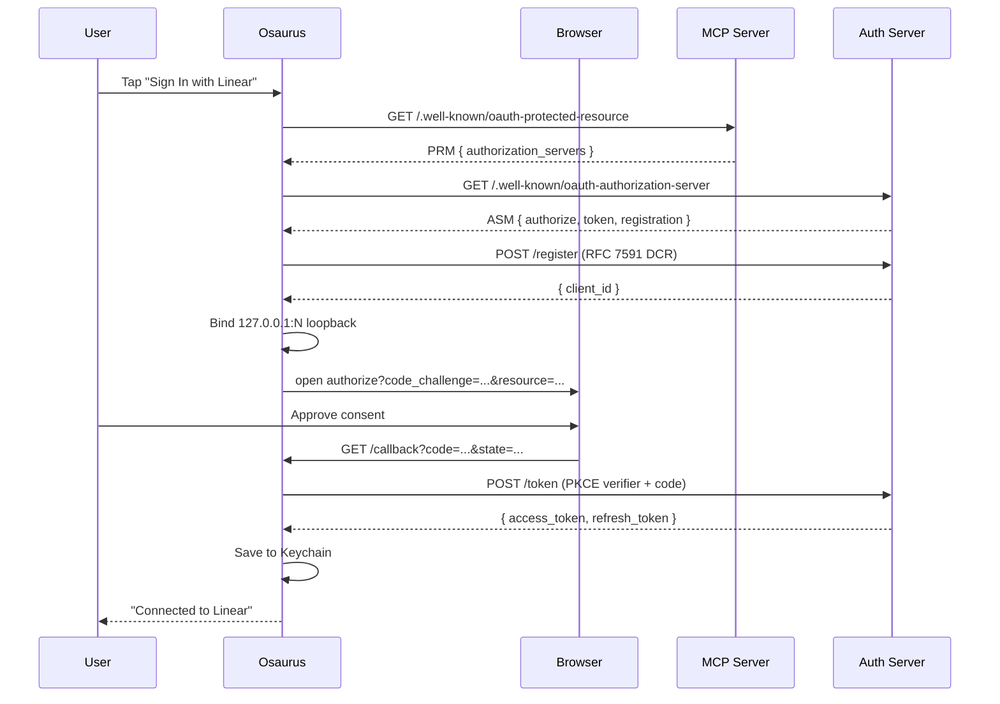

# Remote MCP Providers

Remote MCP Providers connect Osaurus to external MCP (Model Context Protocol) servers and aggregate their tools into your local Osaurus instance. The model can then call those remote tools the same way it calls local plugins.

This is different from [Remote Providers](REMOTE_PROVIDERS.md) (which provide _inference_ endpoints). Remote MCP Providers provide **tools**.

Remote MCP Providers are client connections to MCP tool servers. Osaurus can
connect to HTTP/SSE MCP endpoints and can also launch configured stdio MCP
subprocesses. Command-based stdio is supported in the opposite direction too:
external MCP clients can launch Osaurus with `osaurus mcp` to use Osaurus as
their MCP server.

---

## Supported Transports

| Direction | Transport | Status | How to configure |
| --- | --- | --- | --- |
| External MCP client -> Osaurus | Stdio command | Supported | Configure the client with `command: "osaurus"` and `args: ["mcp"]`. |
| External MCP client -> Osaurus | HTTP endpoints | Supported | Use `GET /mcp/tools` and `POST /mcp/call` on the local Osaurus server. |
| Osaurus -> remote MCP provider | HTTP endpoint | Supported | Add a provider URL in **Custom Server** or choose a catalog template. |
| Osaurus -> remote MCP provider | HTTP streaming / SSE | Supported when the server supports it | Enable **Streaming Enabled** in Advanced. |
| Osaurus -> third-party local MCP provider | Stdio command | Supported | Choose **Stdio** in Custom Server and configure command, args, env, execution host, and working directory. |

If a vendor publishes a stdio config such as `{"command": "npx", "args": [...]}`,
enter that command in the Stdio editor. The **Test** button launches the
subprocess, runs the MCP initialize/listTools flow, reports the tool count or
spawn/protocol error, and tears the subprocess down. For host-executed stdio
providers, GUI apps may not inherit your shell `PATH`; use a full executable
path such as `/opt/homebrew/bin/npx` when a command-not-found diagnostic appears.

---

## Adding a Provider

The Add Provider sheet is a two-step flow.

### Step 1 — Pick a service

`⌘ Shift M` → **Providers** → **+ Add Provider**.

You land on a catalog grid with a search bar at the top. Type to filter by name or tagline ("issues" finds Linear, "search" finds Exa). The first card is always **Custom Server** for any HTTP(S) MCP endpoint you want to point at; the rest are pre-vetted well-known providers (see [Provider Catalog](#provider-catalog) below).

### Step 2 — Connect

Tapping a card takes you to one of three configure screens depending on what the vendor supports.

#### OAuth 2.1 (with Dynamic Client Registration)

Used by Linear, Notion, Vercel, Supabase, Cloudflare, Hugging Face, Sentry, Stripe, PayPal, Canva, Square, Webflow, Buildkite, Cloudinary, monday.com, Neon, Netlify, Stack Overflow.

- One big **Sign In with [Provider]** button.
- Tap it → your default browser opens to the vendor's OAuth consent screen.
- After you approve, the browser redirects back to a loopback URL Osaurus is listening on (`http://127.0.0.1:<ephemeral>/callback`).
- A green **Connected** badge appears.
- Click **Add Provider**. Done.

No client ID, secret, or redirect URI to configure — Osaurus uses [RFC 7591 Dynamic Client Registration](https://datatracker.ietf.org/doc/html/rfc7591) to register itself with the vendor on the fly.

#### OAuth 2.1 (manual Client ID + Client Secret)

Used by HubSpot.

Some vendors require confidential-client OAuth and don't publish a `registration_endpoint`, so DCR can't bootstrap a client. For these the connect-known sheet renders an extra setup card:

1. Click **Open [Provider] docs** to land on the vendor's OAuth-app instructions.
2. Register a new OAuth app and **copy this exact redirect URI** into its allowed list — the sheet shows it with a **Copy** button (e.g. `http://127.0.0.1:33267/callback` for HubSpot).
3. Paste the resulting **Client ID** and **Client Secret** into the form.
4. Click **Sign In with [Provider]**, complete the browser flow, then **Add Provider**.

The Client Secret is stored in your macOS Keychain alongside access/refresh tokens and is sent only to the vendor's token endpoint. The loopback port is pinned to the value the vendor expects, so future refreshes keep working without re-registering the app.

> HubSpot specifics — Create your app at **HubSpot Developer Portal → Development → MCP Auth Apps**, paste `http://127.0.0.1:33267/callback` as the redirect URL, and copy the issued Client ID + Client Secret. Private App PATs (`pat-na1-…`) do not authenticate against `mcp.hubspot.com` and will return 401 — they only work with HubSpot's REST APIs and the self-hosted Developer MCP npm package.

#### API Key (bearer token)

Used by GitHub Copilot MCP, Atlassian Rovo MCP, Zapier.

- A secure text field labeled **API Key**.
- A **Where do I get my key?** link that opens the vendor's docs.
- Paste the key, click **Add Provider**.

The key is written to your macOS Keychain (never to disk in plaintext) and sent on every request as `Authorization: Bearer <key>`.

#### No Auth

Used by DeepWiki, Exa Search, Keenable.

- A small green **This server doesn't require authentication.** confirmation.
- Click **Add Provider**.

#### Self-Hosting (Google Workspace)

Google Workspace doesn't ship a hosted remote MCP. Tapping the card opens the [community Google Workspace MCP project](https://github.com/taylorwilsdon/google_workspace_mcp) in your browser and drops you into the Custom Server form so you can paste your own deployment's URL.

#### Custom Server

The freeform editor — Name, URL, Auth picker (None / Bearer Token / OAuth), Custom Headers, Advanced (timeouts, streaming, auto-connect). Use this for any URL-reachable MCP server not in the catalog, or to override fine-grained settings on one that is.

Custom Server supports both HTTP/SSE and stdio. HTTP/SSE providers use the
global proxy policy when one is configured. Stdio providers run a local
subprocess and therefore do not send traffic through URLSession's proxy path.
The Test button now records a provider health snapshot after the explicit
initialize/listTools probe. The copied probe result includes the stable reason
code (`succeeded`, `invalidURL`, `missingCommand`, `commandNotFound`,
`sandboxUnavailable`, `spawnFailed`, `timeout`, `authRequired`,
`protocolError`, or `connectionFailed`) plus the stage that failed, but never
includes credentials, env values, headers, request bodies, or tokens.

---

## Provider Catalog

The catalog is hardcoded in [`MCPProviderTemplate.swift`](../Packages/OsaurusCore/Models/Configuration/MCPProviderTemplate.swift). Templates are pure UI prefills — saving from one produces an `MCPProvider` record identical to one you would build by hand, so removing or editing a template later never affects already-saved providers.

| Provider             | Category            | Auth     | Endpoint                                                                                            |
| -------------------- | ------------------- | -------- | --------------------------------------------------------------------------------------------------- |
| **Atlassian**        | Software            | API Key  | `https://mcp.atlassian.com/v1/mcp`                                                                  |
| **Buildkite**        | DevOps              | OAuth    | `https://mcp.buildkite.com/mcp`                                                                     |
| **Canva**            | Design              | OAuth    | `https://mcp.canva.com/mcp`                                                                         |
| **Cloudflare**       | Infrastructure      | OAuth    | `https://mcp.cloudflare.com/mcp`                                                                    |
| **Cloudinary**       | Asset Management    | OAuth    | `https://asset-management.mcp.cloudinary.com/mcp`                                                   |
| **DeepWiki**         | RAG                 | None     | `https://mcp.deepwiki.com/mcp`                                                                      |
| **Exa Search**       | Search              | None     | `https://mcp.exa.ai/mcp`                                                                            |
| **GitHub**           | Software            | API Key  | `https://api.githubcopilot.com/mcp/`                                                                |
| **Google Workspace** | Productivity        | _self-hosted_ | (user-supplied — see [community project](https://github.com/taylorwilsdon/google_workspace_mcp)) |
| **HubSpot**          | CRM                 | OAuth (manual app) | `https://mcp.hubspot.com`                                                                 |
| **Hugging Face**     | AI                  | OAuth    | `https://huggingface.co/mcp`                                                                        |
| **Keenable**         | Search              | None     | `https://api.keenable.ai/mcp`                                                                       |
| **Linear**           | Project Management  | OAuth    | `https://mcp.linear.app/mcp`                                                                        |
| **monday.com**       | Project Management  | OAuth    | `https://mcp.monday.com/mcp`                                                                        |
| **Neon**             | Database            | OAuth    | `https://mcp.neon.tech/mcp`                                                                         |
| **Netlify**          | Hosting             | OAuth    | `https://netlify-mcp.netlify.app/mcp`                                                               |
| **Notion**           | Productivity        | OAuth    | `https://mcp.notion.com/mcp`                                                                        |
| **PayPal**           | Payments            | OAuth    | `https://mcp.paypal.com/mcp`                                                                        |
| **Sentry**           | Observability       | OAuth    | `https://mcp.sentry.dev/mcp`                                                                        |
| **Square**           | Payments            | OAuth    | `https://mcp.squareup.com/mcp`                                                                      |
| **Stack Overflow**   | Q&A                 | OAuth    | `https://mcp.stackoverflow.com/mcp`                                                                 |
| **Stripe**           | Payments            | OAuth    | `https://mcp.stripe.com`                                                                            |
| **Supabase**         | Database            | OAuth    | `https://mcp.supabase.com/mcp`                                                                      |
| **Vercel**           | Hosting             | OAuth    | `https://mcp.vercel.com/mcp`                                                                        |
| **Webflow**          | CMS                 | OAuth    | `https://mcp.webflow.com/mcp`                                                                       |
| **Zapier**           | Automation          | API Key  | `https://mcp.zapier.com/api/mcp/mcp`                                                                |

URLs are vetted against the upstream [`awesome-remote-mcp-servers`](https://github.com/jaw9c/awesome-remote-mcp-servers) list. If a vendor changes their endpoint, you can always tap **Custom Server** and enter the new one without an app update.

### Why some popular providers are missing

The catalog only includes providers whose remote MCP server supports either:

- OAuth 2.1 with Dynamic Client Registration ([RFC 7591](https://datatracker.ietf.org/doc/html/rfc7591)), or
- OAuth 2.1 with manual Client ID + Client Secret entry against a vendor with a single documented redirect URI (HubSpot's MCP Auth Apps), or
- a documented bearer-token / API-key fallback (used for GitHub and Atlassian, whose OAuth requires a pre-registered app), or
- no authentication at all.

Providers requiring multi-step manual OAuth-app registration with no PAT fallback (Asana V2, Intercom, Plaid) or a multi-step API-key + GCP-IAM dance (Google BigQuery, Maps, GKE) are intentionally omitted today — the auto-flow would silently fail for end users. Use **Custom Server** if you need them.

---

## Editing an Existing Provider

Click the row's edit menu. Edit-mode skips the catalog and opens the freeform editor directly so you can change anything (name, URL, auth, headers, timeouts) regardless of whether the provider was originally added from a template.

## Provider Diagnostics

Each provider row has a copyable diagnostics section in the expanded details.
It reports connection state, auth mode, transport, proxy policy, and the best
repro path. The copied text is safe to paste in an issue or Discord thread; it
does not include bearer tokens, OAuth tokens, request bodies, env values, or raw
headers.

The top of the Providers page includes an **MCP Server Hub** summary when at
least one provider exists. It aggregates connected, attention, tool, stdio, and
host-stdio counts, and the segmented filter lets you narrow the row list to all,
attention, connected, stdio, HTTP, or disabled providers. The hub actions can
probe every enabled provider, reconnect every enabled provider, or copy a single
redacted support report for the whole provider set.

For stdio providers, diagnostics distinguish sandbox vs host execution and point
command-not-found failures at the executable path/PATH fix. For HTTP/SSE
providers, diagnostics show whether the global proxy is active, disabled, or
ignored because the saved URL failed validation. Local MCP rows also include the
last explicit health snapshot and a capture-policy row. The capture row is policy
only for remote-provider tools: screenshot/capture access remains off unless a
trusted plugin is installed, enabled, opted in by the user, granted permission,
and invoked interactively. The in-app `/screenshot` command is separate from
remote MCP providers and is not exposed through external tool surfaces.

---

## Configuration Reference

### Connection (always shown)

| Setting     | Description                         |
| ----------- | ----------------------------------- |
| **Name**    | Display name for the provider       |
| **URL**     | Full HTTP(S) URL to the MCP server endpoint |
| **Enabled** | Whether the provider is active      |

### Authentication

| Mode             | Description                                                                                                                                |
| ---------------- | ------------------------------------------------------------------------------------------------------------------------------------------ |
| **None**         | No `Authorization` header added.                                                                                                           |
| **Bearer Token** | Token sent as `Authorization: Bearer <token>`. Stored in macOS Keychain.                                                                   |
| **OAuth**        | RFC 9728 PRM + RFC 8414 ASM discovery, RFC 7591 DCR, RFC 8252 loopback redirect, PKCE S256, RFC 8707 resource indicators, auto refresh.   |

### Custom Headers

Add arbitrary HTTP headers. Mark a header as a **secret** to store its value in Keychain instead of `mcp.json`.

### Advanced

| Setting               | Description                               | Default |
| --------------------- | ----------------------------------------- | ------- |
| **Auto-connect**      | Connect automatically when Osaurus starts | true    |
| **Streaming Enabled** | Use the streaming/SSE HTTP transport when the server supports it | false   |
| **Discovery Timeout** | Timeout for tool discovery (seconds)      | 20      |
| **Tool Call Timeout** | Timeout for tool execution (seconds)      | 45      |

---

## How OAuth Auto Sign-In Works



The implementation lives in [`Packages/OsaurusCore/Services/MCP/OAuth/`](../Packages/OsaurusCore/Services/MCP/OAuth/) and uses the shared loopback server in [`Packages/OsaurusCore/Services/Auth/OAuthLoopbackServer.swift`](../Packages/OsaurusCore/Services/Auth/OAuthLoopbackServer.swift).

### Token Refresh & 401 Recovery

- Access tokens are refreshed proactively before they expire.
- If a request returns `401 Unauthorized`, Osaurus probes the response's `WWW-Authenticate: Bearer` challenge, refreshes once, and retries. If that also fails, the provider's row surfaces a "Sign in again" prompt.
- All tokens (access + refresh) live in Keychain; `mcp.json` only stores client IDs and metadata.

---

## How It Works (Tool Discovery & Execution)

### Tool Discovery

When you connect to an MCP provider:

1. Osaurus establishes an HTTP/SSE connection to the MCP server (with bearer / OAuth headers as appropriate).
2. Sends a `tools/list` request to discover available tools.
3. Registers each tool with a namespaced name.
4. Tools become available for model inference.

### Tool Namespacing

To prevent naming conflicts, tools from remote MCP providers are prefixed with the provider name:

```
provider_toolname
```

For example, a Linear provider with a tool called `search_issues` is registered as:

```
linear_search_issues
```

### Tool Execution

When a model calls a remote MCP tool:

1. Osaurus receives the tool call request.
2. Routes it to the correct MCP provider.
3. Sends the request to the remote MCP server.
4. Returns the result to the model.

---

## Using Remote MCP Tools

### In Chat

Remote MCP tools work like any other tool. When a model decides to use a tool, Osaurus handles the routing automatically.

### Via MCP API

List all tools (including remote ones):

```bash
curl http://127.0.0.1:1337/mcp/tools
```

If Server > Network exposure is enabled, local loopback auth bypass is disabled.
Use an access key from Settings > Server > Authentication:

```bash
curl -H "Authorization: Bearer $OSAURUS_MCP_ACCESS_KEY" \
  http://127.0.0.1:1337/mcp/tools
```

Call a remote tool directly:

```bash
curl http://127.0.0.1:1337/mcp/call \
  -H "Authorization: Bearer $OSAURUS_MCP_ACCESS_KEY" \
  -H "Content-Type: application/json" \
  -d '{
    "name": "linear_search_issues",
    "arguments": {"query": "open bugs"}
  }'
```

---

## Connection States

MCP Providers can be in the following states:

| State            | Indicator       | Description                         |
| ---------------- | --------------- | ----------------------------------- |
| **Connected**    | Green           | Active connection, tools discovered |
| **Connecting**   | Blue (animated) | Establishing connection             |
| **Disconnected** | Gray            | Not connected                       |
| **Disabled**     | Gray            | Manually disabled                   |
| **Error**        | Red             | Connection or discovery failed      |
| **Needs Sign-In**| Amber           | OAuth tokens expired or revoked     |

When connected, the provider card shows tool count, last connected timestamp, and any error messages.

---

## Testing Connections

The freeform Custom Server form has a **Test** button. For HTTP/SSE providers it
runs initialize/listTools against the configured URL and reports the typed
result. For stdio providers it launches the configured command, completes the
same MCP initialize/listTools flow, reports the tool count or reason-coded
spawn/protocol error, records the health snapshot, and then tears the subprocess
down. The OAuth and API-key catalog screens skip this button — saving and
connecting is the test.

---

## Troubleshooting

### "Connection refused"

- Verify the MCP server is running.
- Check the URL is correct (including protocol and port).
- Ensure no firewall is blocking the connection.

### "My provider config has `command` and `args`"

That is a stdio MCP provider config. Choose **Custom Server**, switch the
transport to **Stdio**, and enter the command/args there. `command: "osaurus"`
with `args: ["mcp"]` is still the opposite direction: external MCP clients use
that to launch Osaurus as their MCP server.

### "Authentication failed" / `401 Unauthorized`

- For OAuth: tokens may have expired or been revoked. Tap **Re-authenticate** on the provider card.
- For Bearer Token: verify the token is correct and has the required scopes (e.g., GitHub PATs need `read:user` and repo scopes for the Copilot MCP).
- Check whether the vendor requires custom headers (some need an `X-Account-Id` etc.).

### "This server doesn't advertise OAuth metadata, so automatic sign-in isn't supported."

The vendor's MCP server doesn't publish [RFC 9728 protected-resource metadata](https://datatracker.ietf.org/doc/html/rfc9728) and/or doesn't support [RFC 7591 dynamic client registration](https://datatracker.ietf.org/doc/html/rfc7591), so the auto-flow can never bootstrap. Pick **Custom Server** and use a personal access token instead. (This is exactly the case GitHub and Atlassian fall under — both ship as API Key templates rather than OAuth for that reason.)

### "Discovery timeout"

- The MCP server may be slow to respond.
- Try increasing the discovery timeout in **Advanced**.
- Check server health.

### "No tools discovered"

- The MCP server may not expose any tools.
- Check the server's tool configuration.
- For scoped OAuth providers, check that you approved all the requested scopes.

### Debug Mode

Use the **Insights** tab to monitor MCP provider activity:

1. Open Management window (`⌘ Shift M`).
2. Click **Insights** in the sidebar.
3. Filter by source or search for your provider name.

---

## Security

### Token Storage

- Bearer tokens, OAuth access tokens, OAuth refresh tokens, and DCR client secrets all live in the macOS Keychain — encrypted at rest, scoped to your login, never written to `mcp.json`.
- Custom headers marked **secret** are stored in Keychain too.

### Loopback Redirect

OAuth callbacks come back to `http://127.0.0.1:<ephemeral>/callback` (per [RFC 8252 §7.3](https://datatracker.ietf.org/doc/html/rfc8252#section-7.3)). The port is kernel-assigned per sign-in attempt; nothing is left listening between attempts.

### CSRF / State

Every authorization request includes a cryptographically random `state` parameter that's verified on callback — mismatched states are rejected.

### Configuration File

Non-secret configuration is stored at:

```
~/.osaurus/providers/mcp.json
```

Each provider record carries its `name`, `url`, `enabled`, headers (non-secret
only), timeouts, `authType` (`none` | `bearerToken` | `oauth`), `transport`
(`http` | `stdio`), and — for OAuth — non-secret discovery metadata
(`oauth.clientId`, `oauth.scopes`, `oauth.authorizationEndpoint`, etc.). Stdio
records also carry non-secret `command`, `args`, `env`, execution host, and
working-directory fields. Secret stdio env values live in Keychain.

Existing pre-OAuth `mcp.json` files keep working unchanged; missing fields default to `bearerToken` for backwards compatibility.

---

## Architecture

```
┌─────────────────────────────────────────────────────────────────┐
│                        Osaurus                                   │
│  ┌─────────────────────────────────────────────────────────┐    │
│  │                   ToolRegistry                           │    │
│  │  ┌──────────────┐  ┌──────────────┐  ┌──────────────┐   │    │
│  │  │ Local Plugin │  │ Local Plugin │  │ MCP Provider │   │    │
│  │  │   (browser)  │  │ (filesystem) │  │    Tools     │   │    │
│  │  └──────────────┘  └──────────────┘  └──────┬───────┘   │    │
│  └─────────────────────────────────────────────│───────────┘    │
│                                                 │                │
│  ┌─────────────────────────────────────────────│───────────┐    │
│  │              MCPProviderManager              │           │    │
│  │  ┌─────────────────────────────────────────┴────────┐   │    │
│  │  │       MCP Client (HTTP/SSE + stdio)                │   │    │
│  │  │     ├── PRM/ASM Discovery                         │   │    │
│  │  │     ├── DCR + PKCE OAuth flow                     │   │    │
│  │  │     ├── Local stdio subprocess runners            │   │    │
│  │  │     └── Token refresh + 401 retry                 │   │    │
│  │  └─────────────────────────────────────────┬────────┘   │    │
│  └─────────────────────────────────────────────│───────────┘    │
└─────────────────────────────────────────────────│────────────────┘
                                                  │
                                                  ▼
                               ┌─────────────────────────────┐
                               │   Remote MCP Server         │
                               │   (HTTP/SSE endpoint)       │
                               │   ├── tool1                 │
                               │   ├── tool2                 │
                               │   └── tool3                 │
                               └─────────────────────────────┘
```

---

## Related Documentation

- [Remote Providers](REMOTE_PROVIDERS.md) — Connect to inference APIs
- [Plugin Authoring](plugins/README.md) — Create local plugins
- [FEATURES.md](FEATURES.md) — Feature inventory
- [README](../README.md) — Quick start guide
