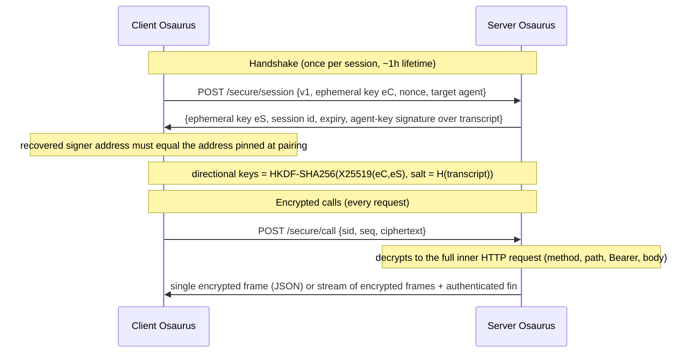

# Osaurus Secure Channel

**True end-to-end encryption for agent-to-agent communication.**

When two Osaurus agents talk to each other — across your home network or across the world through the Osaurus Relay — nobody in between can read, modify, replay, or truncate the conversation. Not your router, not the coffee-shop Wi-Fi, not even the relay infrastructure itself.

This is not "we use HTTPS." This is a dedicated cryptographic channel, built on the same design patterns as TLS 1.3 and Signal, where the **only** parties holding the keys are the two agents at each end.

---

## Why this matters

Most "connected AI agent" products route your prompts, responses, and credentials through cloud infrastructure that can see everything. Even self-hosted setups that use a tunneling relay (ngrok-style) hand the relay operator a TLS-terminating man-in-the-middle position by construction.

Osaurus agents are different:

| | Typical cloud agents | Tunnel/relay setups | **Osaurus Secure Channel** |
|---|---|---|---|
| Who can read your prompts in transit | The provider | The relay operator | **Only the two agents** |
| Who can read your API credentials | The provider | The relay operator | **Only the two agents** |
| Past traffic safe if keys leak later | Usually not | Usually not | **Yes — forward secrecy** |
| Peer identity verified cryptographically | Account-based | Rarely | **Yes — pinned at pairing** |
| Replayed requests re-execute | Often | Often | **Never** |
| Silently truncated responses detected | No | No | **Yes — authenticated `fin`** |
| Downgrade to plaintext possible | — | Often silently | **No — hard-refused (426)** |

Your prompts, your models' responses, and your access keys stay between your machines. The relay becomes a **blind pipe**: it forwards ciphertext it cannot open.

## The headline guarantees

1. **End-to-end encrypted.** Every agent request and response — including streamed tokens — is sealed with ChaCha20-Poly1305 using keys that exist only on the two endpoints. LAN observers and the relay see ciphertext.

2. **Forward secrecy.** Session keys come from a fresh ephemeral X25519 exchange every session. Even if a device's long-term identity key is compromised later, recorded past traffic can never be decrypted. (This is a property HPKE-style per-request encryption *cannot* provide — it's why the channel uses a real handshake.)

3. **Mutual authentication.**
   - *You know who you're talking to:* the server signs the handshake transcript with its secp256k1 agent key, and the client verifies the recovered address against the address it pinned when you paired — an impostor or man-in-the-middle cannot complete a handshake.
   - *The server knows who's calling:* your `osk-v1` access key travels **inside** the ciphertext and is validated by the exact same auth gate as before. After pairing, credentials never cross the network in plaintext again.

4. **Tamper, replay, and truncation proof.** Sequence numbers double as AEAD nonces and are cryptographically bound to the session, direction, and call. A captured request can never re-execute (sliding anti-replay window → `409`). Response streams end with an authenticated `fin` frame, so a connection cut mid-stream is detected instead of silently passing as a complete answer.

5. **No downgrade, ever.** Remote requests to agent execution routes (`/agents/{id}/run`, `/agents/{id}/dispatch`) that arrive outside the channel are refused with `426 Upgrade Required`. There is no fallback mode an attacker can force. Local callers (CLI, App Intents, scripts on the same machine) keep working unchanged, and `/models` metadata stays plaintext-compatible for third-party OpenAI-SDK clients.

6. **Zero configuration.** There is nothing to set up. Pairing two agents — over Bonjour on the LAN or via a relay invite — is all it takes. Capability is advertised automatically (`osc=1` in Bonjour TXT, `secureChannel` in pair responses), sessions are established and refreshed transparently, and mixed-version setups produce a clear "upgrade Osaurus" message instead of a cryptic failure.

---

## How it works

The channel is a SIGMA-style authenticated key exchange — the pattern underlying TLS 1.3 and the Noise framework — built entirely from primitives already trusted elsewhere in Osaurus: secp256k1 identity signatures, X25519, HKDF-SHA256, and ChaCha20-Poly1305.

**One outer endpoint.** Every encrypted call is a `POST /secure/call` whose ciphertext decrypts to the complete inner HTTP request — method, path, `Authorization`, headers, body. Server-side, decryption happens at a single choke point and the inner request flows through the existing auth gate, agent-scope check, and routing **unchanged**. Responses are sealed transparently on the way out: buffered JSON becomes one authenticated frame (with the real status code inside the ciphertext); SSE streams become per-event encrypted frames ending in `fin`.

**Relay-transparent by design.** Because the channel sits above HTTP and frames are JSON/base64url, the relay tunnel needed **zero changes** — it carries opaque frames it cannot read, and its UTF-8 WebSocket framing is unaffected.

### Cryptographic recipe

| Component | Choice |
|---|---|
| Key agreement | Ephemeral-ephemeral X25519 (Curve25519, CryptoKit) |
| Identity / transcript signature | secp256k1, domain-separated prefix `Osaurus Secure Channel`, address recovery via Keccak-256 |
| Key derivation | HKDF-SHA256, salted with the transcript hash, two independent 32-byte directional keys |
| Bulk encryption | ChaCha20-Poly1305 AEAD |
| Nonces | Per-direction monotonic sequence numbers (no random-nonce collision risk) |
| AAD binding | session id ‖ direction ‖ sequence ‖ `fin` flag — frames cannot be moved between sessions, directions, or calls |
| Anti-replay | IPsec-style sliding window on request sequence numbers |
| Response isolation | Per-call response keys derived from the request sequence number |
| Session lifetime | 1 hour, bounded server-side store, transparent re-handshake on expiry |

### Threat model at a glance

| Adversary | Outcome |
|---|---|
| Passive LAN sniffer | Sees ciphertext only; credentials and content never visible after pairing |
| Active MITM (ARP spoof, rogue AP, malicious relay) | Cannot complete the handshake — the transcript signature pins the genuine agent key |
| Relay operator (TLS-terminating by construction) | Blind pipe; forwards opaque frames, learns only timing/size |
| Attacker replaying captured traffic | Rejected by the anti-replay window (`409 secure_replay`) |
| Attacker truncating a streamed response | Missing authenticated `fin` → detected client-side, surfaced as an error |
| Attacker forcing a plaintext fallback | None exists: remote plaintext on agent routes → `426 Upgrade Required` |
| Future compromise of a device's identity key | Past sessions stay sealed — forward secrecy from ephemeral X25519 |

What the channel does **not** hide: traffic timing and approximate sizes (true of any encrypted transport), and metadata the relay needs for routing (which tunnel a frame belongs to).

---

## Developer reference

### Endpoints

| Endpoint | Purpose | Notes |
|---|---|---|
| `POST /secure/session` | Handshake | Public, rate-limited per source IP; grants nothing by itself |
| `POST /secure/call` | Encrypted request envelope | Ciphertext decrypts to the inner request; inner auth fully enforced |

### Error codes

| Status | Code | Meaning | Client action |
|---|---|---|---|
| `426` | `secure_channel_required` | Plaintext request to a protected agent route from a remote caller | Upgrade Osaurus / use the channel |
| `401` | `secure_session_unknown` | Session expired or server restarted | Re-handshake (automatic) |
| `409` | `secure_replay` | Sequence number already consumed | Never retry the same envelope |
| `400` | `secure_malformed` | Bad envelope, or inner request targeting `/secure/*` | Fix the request |

### Code map

| Layer | File |
|---|---|
| Protocol core (handshake, key schedule, framing, anti-replay, `fin`) | `Packages/OsaurusCore/Identity/SecureChannel.swift` |
| Server session registry (bounded, TTL-pruned) | `Packages/OsaurusCore/Identity/SecureSessionStore.swift` |
| Server endpoints + decrypt-and-rewrite + 426 gate | `Packages/OsaurusCore/Networking/HTTPHandler.swift` |
| Transparent response encryption (NIO outbound handler) | `Packages/OsaurusCore/Networking/SecureChannelResponseEncryptor.swift` |
| Client session cache, identity verification, re-handshake, SSE decrypt | `Packages/OsaurusCore/Services/Provider/SecureChannelClient.swift` |
| Remote-provider integration (`.osaurus` providers) | `Packages/OsaurusCore/Services/Provider/RemoteProviderService.swift` |
| Capability advertisement (`osc=1`) | `Packages/OsaurusCore/Networking/BonjourAdvertiser.swift` / `BonjourBrowser.swift` |
| Transcript signature domain prefix | `Packages/OsaurusCore/Identity/CryptoHelpers.swift` |

### Test coverage

- `Tests/Identity/SecureChannelTests.swift` — handshake roundtrip, wrong-identity and tampered-transcript rejection, version negotiation, replay/reorder windows, cross-session and cross-call frame rejection, `fin` authentication, truncation detection.
- `Tests/Networking/SecureChannelE2ETests.swift` — full NIO server: encrypted buffered and SSE calls, replay → `409`, unknown session → `401`, the `426` gate (plaintext remote refused, loopback allowed, encrypted relay-origin passes), inner auth still enforced, built-in-agent guard still fires inside the channel, per-agent scope enforced on `GET /agents/{id}` (a cross-agent scoped key is refused `403 agent_scope_denied` inside the ciphertext), no `/secure/*` nesting.

### Compatibility

- **Osaurus ↔ Osaurus (current versions):** fully encrypted, automatic.
- **Osaurus ↔ older Osaurus:** older peers cannot execute agents on upgraded peers until they upgrade (deliberate — no downgrade path). A clear upgrade message is shown in both directions.
- **Third-party OpenAI SDK clients:** unaffected. `/models` and metadata routes keep accepting plaintext; the hard-require applies only to Osaurus peer agent-execution routes.
- **Local callers (CLI, App Intents, same-machine scripts):** unaffected; loopback stays plaintext.

---

## Relationship to the rest of the security stack

The Secure Channel composes with — it does not replace — the existing layers documented in [`IDENTITY.md`](IDENTITY.md) and [`SECURITY.md`](SECURITY.md):

- **Pairing** establishes *who* a peer is (HPKE-sealed key delivery, challenge-response, server signature verification) and pins the agent address the channel later verifies on every handshake.
- **`osk-v1` access keys** still authenticate *every* call — now inside the ciphertext — with unchanged scoping (`403 agent_scope_denied` for cross-agent use, on both the run route `/agents/{id}/run` and the `GET /agents/{id}` metadata route) and instant revocation.
- **Relay trust hardening** (no loopback trust for relay-origin traffic) still applies to the decrypted inner request.
- **Per-agent host workspace** rides on this trust boundary: only a caller that completed the handshake and passed the agent-scope gate can have a remote agent read/write files inside the folder its owner granted (host **file** tools only — `shell_run` / `git_commit` / `file_undo` stay denied). See [`SECURITY.md`](SECURITY.md) and [`OpenAI_API_GUIDE.md`](OpenAI_API_GUIDE.md).
- **Storage encryption** protects data at rest; the Secure Channel protects it in motion between agents.

Together: keys are sealed at delivery, pinned at pairing, verified at every session, and never travel in plaintext again — and everything an agent says travels inside a forward-secret envelope only the two endpoints can open.
