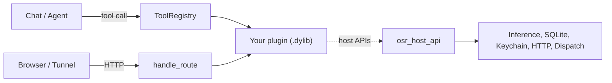

# Plugin Authoring Guide

This is the conceptual guide for how Osaurus plugins are structured, loaded, and integrated. For a hands-on first run, start with [QUICKSTART.md](QUICKSTART.md). For an exhaustive callback list, see [HOST_API.md](HOST_API.md).

## Mental model



A plugin is a single dynamic library that:

1. **Declares** what it can do via a JSON manifest returned from `get_manifest`
2. **Implements** that capability via `invoke` (for tools) and `handle_route` (for HTTP)
3. **Calls back** into Osaurus via the `osr_host_api*` it received at init

The host enforces:

- Per-plugin SQLite + Keychain isolation
- Per-plugin inference inflight cap (no single plugin can starve the host)
- SSRF protection on outbound HTTP
- 50 MB cap on `file_read` and a hard scope to the artifacts directory
- Dispatch rate limit of 10/min per (plugin, agent) pair

## Lifecycle

```
dlopen
   │
   ▼
osaurus_plugin_entry_v2(host)   ← single export, returns osr_plugin_api*
   │
   ▼
init()                          ← plugin returns opaque ctx pointer
   │
   ▼
get_manifest(ctx)               ← plugin returns JSON manifest
   │
   ▼
[Live: invoke / handle_route / on_config_changed / on_task_event]
   │
   ▼
destroy(ctx)                    ← Osaurus shuts the plugin down
```

The plugin context (`osr_plugin_ctx_t`) is opaque to the host. Plugins use it to carry their own per-instance state.

## Manifest

`get_manifest` returns a JSON string. Top-level fields:

```json
{
  "plugin_id": "dev.example.MyPlugin",
  "name": "My Plugin",
  "version": "0.1.0",
  "description": "What this plugin does",
  "license": "MIT",
  "authors": ["Your Name"],
  "min_macos": "15.0",
  "min_osaurus": "0.5.0",
  "instructions": "System prompt fragment appended during plugin-initiated inference",
  "secrets": [
    {
      "id": "api_key",
      "label": "API Key",
      "description": "Get one from [example.com](https://example.com)",
      "required": true,
      "url": "https://example.com/keys"
    }
  ],
  "capabilities": {
    "tools": [...],
    "routes": [...],
    "config": {...},
    "web": {...},
    "artifact_handler": false
  }
}
```

### Tools

A tool is a function the agent can call from chat.

```json
{
  "id": "hello_world",
  "description": "Return a friendly greeting",
  "parameters": {
    "type": "object",
    "properties": {
      "name": { "type": "string" }
    },
    "required": ["name"]
  },
  "requirements": [],
  "permission_policy": "ask"
}
```

- `id` — used to route to your `invoke` callback. The runtime tool name is automatically prefixed with the plugin id to avoid collisions.
- `description` — fed to the model so it knows what the tool does.
- `parameters` — JSON Schema describing the arguments. The host uses this for preflight validation.
- `requirements` — optional list of system permissions the tool needs (e.g. `["network", "filesystem"]`).
- `permission_policy` — `"auto"` (no prompt), `"deny"` (always reject), or `"ask"` (prompt the user the first time). Defaults to `"ask"`.

Tool return values must conform to the canonical `ToolEnvelope` shape — the single source of truth is [../TOOL_CONTRACT.md](../TOOL_CONTRACT.md). Two envelopes:

**Success:**

```json
{
  "ok": true,
  "tool": "my_tool",
  "result": { "anything": "the model needs" }
}
```

`tool` is optional (helpers populate it). `result` carries the payload — object, array, string, number, bool, or null. Add `warnings: ["..."]` for non-fatal notes.

**Failure:**

```json
{
  "ok": false,
  "kind": "execution_error",
  "message": "Human-readable description",
  "tool": "my_tool",
  "retryable": true
}
```

`kind` must be one of the documented kinds (`invalid_args`, `rejected`, `user_denied`, `timeout`, `execution_error`, `unavailable`, `tool_not_found`). See the kinds table in [TOOL_CONTRACT.md](../TOOL_CONTRACT.md#kinds) for `retryable` defaults and the full field reference.

### Routes

A route is an HTTP endpoint your plugin handles. See [ROUTES_AND_WEB.md](ROUTES_AND_WEB.md) for the full story.

### Config

If your plugin has a settings UI, declare it in `capabilities.config`. Each field becomes an entry in the per-plugin config sheet inside Osaurus. Field types include `text`, `secret`, `toggle`, `select`, `multiselect`, `number`, `readonly`, and `status`.

### Web

A static web UI bundled with your plugin. See [ROUTES_AND_WEB.md#web-uis](ROUTES_AND_WEB.md#web-uis).

### Artifact handler

Set `"artifact_handler": true` if your plugin can act on files the user has shared. The host will dispatch artifact-aware tool calls to you and you can read the bytes via `host->file_read`.

## Tool execution

When the agent calls one of your tools:

1. Osaurus validates the arguments against the tool's JSON Schema.
2. The user is prompted (if `permission_policy == "ask"`) and the answer is remembered.
3. Your `invoke(ctx, "tool", "<tool_id>", payload)` is called with the arguments JSON.
4. Your plugin returns a `ToolEnvelope` JSON string.
5. The host parses it, surfaces the summary to the model, and shows the result in the UI.

Inside `invoke` you can call back into the host. The most common patterns are documented in [HOST_API.md](HOST_API.md).

## Permissions

Plugins request permissions by declaring them in `requirements` per tool. The host enforces:

- **`network`** — outbound HTTP via `host->http_request` (and the SSRF guard already gates loopback / RFC1918)
- **`filesystem`** — `host->file_read` (already scoped to the artifacts dir)
- **System permissions** — features like microphone, accessibility, etc. are gated by macOS itself

Per-plugin ephemeral consent is stored at install time. See [PACKAGING.md#user-consent](PACKAGING.md#user-consent).

## Hot reload during development

`osaurus tools dev` watches your sources, rebuilds on save, and triggers a `com.dinoki.osaurus.control.toolsReload` distributed notification. Osaurus reloads all plugins. There's no need to restart the app.

For state persistence across reloads, write to your per-plugin SQLite database via `host->db_exec` / `host->db_query`. The DB file survives reloads and app restarts.

## Logging and observability

- `host->log(level, message)` — writes to the unified macOS log AND to Osaurus Insights
- Insights → Plugin Activity surfaces every host call your plugin makes (status, latency, request/response bodies)
- Crashes during `init` are caught, surfaced in the UI, and quarantined so the plugin doesn't crash-loop the app

## Threading model

Each plugin gets its own concurrent dispatch queue. Multiple `invoke` and `handle_route` calls can run in parallel. If your plugin needs serialization, use your own locks.

Host APIs are safe to call from any thread. The thread-local plugin context is set by the host before each `invoke` / `handle_route` / `on_config_changed` / `on_task_event` call. If your plugin spawns its own background threads and calls host APIs from them, the host falls back to a global "last dispatched plugin" identifier — this is racy across plugins, so prefer doing host work on a thread that has the original call frame.

## Read next

- [QUICKSTART.md](QUICKSTART.md) — your first plugin
- [HOST_API.md](HOST_API.md) — every host callback in detail
- [ROUTES_AND_WEB.md](ROUTES_AND_WEB.md) — HTTP routes, dev proxy, web UIs
- [DEBUGGING.md](DEBUGGING.md) — fault-finding when things go wrong
- [PACKAGING.md](PACKAGING.md) — sign and ship
