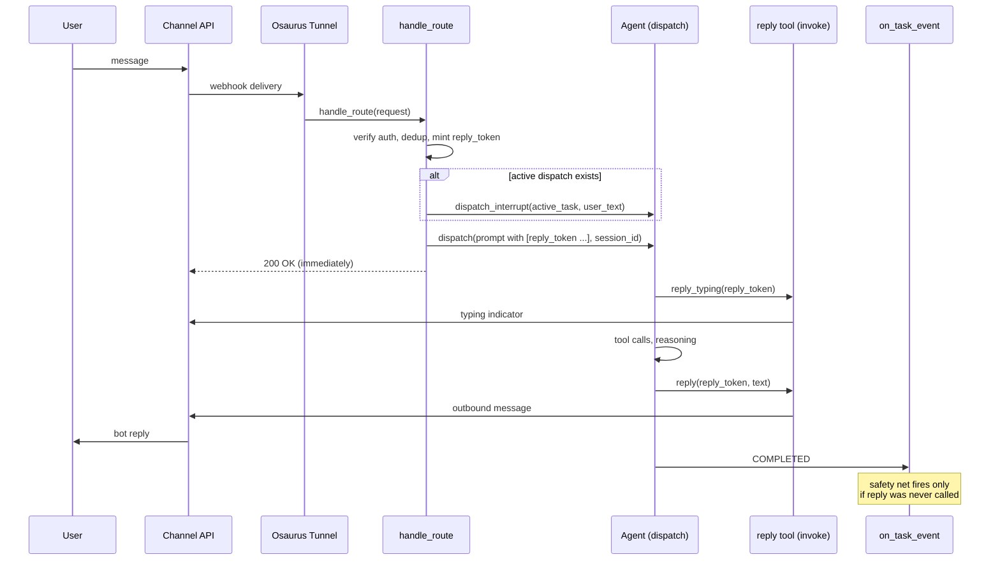

# Messaging Plugin Pattern

Generic recipe for building a conversational Osaurus plugin against any inbound messaging channel — Telegram, Slack, Discord, SMS, email, WhatsApp, or anything else with a webhook-style "user sent a message" event and an outbound API for replying.

This doc is the abstract pattern. [EXAMPLE_TELEGRAM.md](./EXAMPLE_TELEGRAM.md) is the worked example. Read this first to understand the shape, then read the Telegram doc for code-level detail. Use this as a checklist when designing a new messaging plugin.

> See [HOST_API.md](./HOST_API.md) for the canonical reference of every host primitive used here.

---

## What we mean by "messaging plugin"

A plugin that turns an inbound chat surface (Telegram bot, Slack workspace, Discord server, phone number) into a continuous Osaurus conversation. The user sees their familiar app; behind the scenes each conversation maps to one Osaurus session and one agent runs per turn with full access to the Osaurus toolkit.

The shape is the same on every channel:

```
inbound webhook  →  handle_route  →  dispatch  →  agent run
                                                       ↓
                                            calls reply tool(s)
                                                       ↓
outbound API    ←  invoke (reply tool)  ←  plugin's reply handler
```

Once you've internalized this shape, the channel-specific work is small: an auth scheme, a payload parser, an outbound HTTP helper, and a few rules about chunking and rate limits. The architectural bones are identical.

---

## The seven invariants

These hold for every channel. If you find yourself violating one, stop and reconsider.

### 1. The agent never sees the destination address

Don't put the channel-native conversation id (Telegram chat id, Slack channel id, Discord channel id, phone number, email address) into the prompt or any tool parameter the agent reads. Put it behind an opaque **reply token** the plugin mints per turn.

Why: anything the agent reads downstream — web pages during browsing, RAG documents, PDFs the user uploads, even hostile input from the user — can prompt-inject an instruction to redirect output to a different destination. If the agent has the real destination as a parameter, it complies. If it only has an opaque token validated against the plugin's own DB, prompt injection is harmless.

Reply tokens are:

- Short (8 chars, ~40 bits of entropy is plenty)
- Random (cryptographically random, not a counter or hash)
- Bound to one conversation in the plugin DB
- TTL-limited (~10 minutes is typical)
- Single-turn (rotated on each new inbound message)

The agent learns the token from a prompt header like `[reply_token rk_a8f3z1bm]` and is instructed (via the manifest's `instructions` field) to pass it back into every reply call.

### 2. One active dispatch per conversation

A conversation should never have two concurrent agent runs against the same session. That race produces interleaved tool calls, out-of-order messages, and corrupted transcripts.

Enforce this at the schema level with `UNIQUE(conversation_id)` on your active-dispatches table. Use `dispatch_interrupt` (invariant 3) when a new message arrives while a task is in flight.

### 3. Concurrent inbound messages → `dispatch_interrupt`, not queues

When a user sends a follow-up while the agent is still working on the previous message:

```
1. Look up active dispatch for this conversation.
2. dispatch_interrupt(active_task_id, new_user_text)
   → host appends the text as a user-role turn into the live session
   → host cancels the current stream
3. Delete the old active-dispatch row.
4. dispatch(session_id=same) to resume the same session.
   → host's reattachment finds the session and continues with full context.
```

The user gets exactly one coherent reply that reflects the combined input. No queues, no scheduling, no race windows. This is the cleanest concurrency model the host API offers — use it.

### 4. Per-conversation outbound serialization

Multiple sequential `reply` calls from the agent must arrive at the channel in order. HTTP POSTs are independent and race on the network, so without serialization "part 1" and "part 2" can land in either order.

Serialize sends per conversation with a small actor:

```swift
actor PerConversationSendActor {
    static let shared = PerConversationSendActor()
    private var inflight: [String: Task<Void, Never>] = [:]

    func send<T>(conversationId: String, _ work: @escaping () async -> T) async -> T {
        let prior = inflight[conversationId]
        let new = Task { await prior?.value }
        inflight[conversationId] = new
        await new.value
        return await work()
    }
}
```

Cost is ~100ms per chained send. Ordering is deterministic. Worth it.

### 5. Errors return to the agent in-band

When the outbound send fails (user blocked the bot, channel archived, rate limit, expired credentials), don't fire-and-forget. Return a tool envelope with the error so the agent reads it and adapts:

```json
{ "ok": false, "error": "chat_blocked", "message": "User has blocked the bot." }
```

The agent sees the error in the next iteration and can stop trying, log internally, or fall back to a different channel. This is enormously better than the agent thinking it succeeded and continuing to call `reply` against a dead destination.

### 6. Plugin owns meta-messages, agent owns content

Some messages exist outside the agent's control:

| Message type                     | Owner                  |
| -------------------------------- | ---------------------- |
| Conversational reply             | Agent                  |
| Typing / "thinking" indicator    | Agent                  |
| Rich content (photos, files)     | Agent                  |
| Clarify pause question           | Plugin (mirrors agent) |
| Rate-limit apology               | Plugin                 |
| `/reset` confirmation            | Plugin                 |
| FAILED safety-net                | Plugin                 |
| COMPLETED-without-reply fallback | Plugin                 |
| Auth-error notifications         | Plugin                 |

The rule: agent owns content; plugin owns states the agent cannot or did not handle. Plugin-owned messages should be rare in healthy runs.

### 7. `on_task_event` is observability + clarify forwarding + a safety net, not the primary delivery path

Activity events should not be bridged to the channel automatically. The agent calls `reply_typing` itself when about to do slow work — that's a cleaner UX than blasting status pings on every internal tool call.

`on_task_event` does three jobs only:

- **Observability**: log lifecycle.
- **CLARIFICATION (type 3) forwarding**: when the agent calls the inline `clarify` tool to pause, the host fires type 3 with the parsed `{question, options, allow_multiple}` payload and SUPPRESSES the trailing COMPLETED for the duration of the pause. The plugin renders the question (and chips, if any) to the channel and marks the task as "replied" so the safety net stays disarmed. Skipping this branch leaves the user staring at silence — the question text only ever lives in the host's parsed payload, never in any other event.
- **Safety net**: if COMPLETED arrives with `has_replied = 0`, post `event.summary` so the user isn't left hanging. Same for FAILED.

If you find yourself bridging more events to the channel, you've probably moved delivery responsibility from the agent to the plugin, which violates invariant 6. The clarify-forwarding case is special precisely because the question text isn't an agent-owned tool call to a plugin-supplied `reply` tool — it's a host-mediated pause whose payload only the host sees.

---

## Reference architecture



---

## State schema template

Three tables, channel-agnostic. Adjust column types only where the channel's native conversation id forces it (Telegram = INTEGER, Slack/Discord = TEXT).

```sql
-- Persistent: one row per conversation we've ever seen.
CREATE TABLE IF NOT EXISTS conversations (
    conversation_id  TEXT PRIMARY KEY,         -- channel-native id
    session_salt     INTEGER NOT NULL DEFAULT 0,
    blocked          INTEGER NOT NULL DEFAULT 0,
    last_msg_at      INTEGER NOT NULL,
    created_at       INTEGER NOT NULL
);

-- At most one active dispatch per conversation (invariant 2).
CREATE TABLE IF NOT EXISTS active_dispatches (
    task_id          TEXT PRIMARY KEY,
    conversation_id  TEXT NOT NULL UNIQUE,
    reply_token      TEXT NOT NULL UNIQUE,
    session_id       TEXT NOT NULL,
    started_at       INTEGER NOT NULL,
    expires_at       INTEGER NOT NULL,
    has_replied      INTEGER NOT NULL DEFAULT 0
);
CREATE INDEX IF NOT EXISTS idx_dispatches_token
    ON active_dispatches(reply_token);

-- Idempotency: dedup webhook retries.
CREATE TABLE IF NOT EXISTS seen_events (
    event_id         TEXT PRIMARY KEY,         -- channel-native event id
    seen_at          INTEGER NOT NULL
);
```

Session id is derived deterministically: `session_id = UUID5(namespace, channel + ":" + salt + ":" + conversation_id)`. Same conversation always reattaches to the same session. `/reset` (or its equivalent) bumps the salt so the next message lands in a fresh transcript.

---

## The hot path — `handle_route`

Every messaging plugin's webhook handler follows the same eleven steps. The channel-specific code is concentrated in steps 1, 2, and 5.

```
1. Verify auth (channel-specific: HMAC, signing secret, mTLS, IP allowlist).
   Fail closed → 401.

2. Parse payload (channel-specific: JSON, form-encoded, multipart).
   Non-message events (typing, presence, edits) → accept and stop.

3. Dedup by event id. Already seen → 200 OK and stop.

4. Resolve / upsert conversation row. Blocked? → 200 OK and stop.

5. Handle channel-specific control commands (e.g. /reset, /help, /start).
   These are plugin-owned meta-messages. Reply directly via outbound API.

6. Mint reply_token. Build session_id from (salt, conversation_id).

7. Build prompt:
       [reply_token <tok> from <display_name>]
       <user_text>

8. If active dispatch exists for this conversation:
       dispatch_interrupt(active.task_id, user_text)
       DELETE active dispatch row.

9. dispatch(prompt, session_id, title).
   Handle rate_limit_exceeded → plugin-owned apology message.

10. INSERT active_dispatches with (task_id, conversation_id, reply_token, ...).

11. Return 200 immediately. Total elapsed should be tens of milliseconds.
```

The first three steps and step 5 are what makes one channel different from another. Everything else is identical.

---

## Reply tools shape

Three tools cover the common case. Adjust the rich-content tool list for the channel's capabilities.

| Tool                         | Required for                    | Channels that lack it |
| ---------------------------- | ------------------------------- | --------------------- |
| `reply`                      | All                             | None                  |
| `reply_typing`               | Channels with typing indicators | SMS, email            |
| `reply_photo` / `reply_file` | Channels with rich content      | SMS (without MMS)     |
| `reply_reaction`             | Optional                        | SMS, email            |

The `reply` tool's parameter schema:

```json
{
  "reply_token": "string",
  "text": "string",
  "parse_mode": "string"
}
```

Note **no `conversation_id` parameter**. The plugin looks it up from the token (invariant 1). If you find yourself adding a destination parameter, you're about to introduce a prompt-injection vector.

`invoke` for the reply tool runs:

```
1. Decode payload, extract reply_token.
2. SELECT conversation_id, task_id, expires_at FROM active_dispatches
   WHERE reply_token = ?
3. No row? expires_at < now? → return tool envelope error("stale_token", ...)
4. Conversation blocked? → return tool envelope error("chat_blocked", ...)
5. Per-conversation send actor (invariant 4):
     POST outbound API with channel-clamped text
6. On success: UPDATE active_dispatches SET has_replied = 1
   Return tool envelope success.
7. On "user blocked bot" / "channel archived" / "auth expired":
     UPDATE conversations SET blocked = 1
     dispatch_cancel(task_id)
     Return tool envelope error.
8. On other API errors: return tool envelope error with the API description.
```

Step 7 is the channel-specific error mapping. Each channel has its own vocabulary for "this destination is dead" — encode them in a small lookup so all the dead-destination paths produce the same `chat_blocked` envelope.

---

## Auth and security

| Concern                     | Pattern                                                                                                                           |
| --------------------------- | --------------------------------------------------------------------------------------------------------------------------------- |
| Inbound webhook auth        | Channel-specific signature/secret verification inside `handle_route`. Use constant-time comparison. Fail closed → 401.            |
| Outbound credentials        | Stored via `config_set` in the macOS Keychain. Scoped to `(plugin_id, agent_id)` automatically. Never logged.                     |
| Rotation                    | A "regenerate webhook secret" or "reauth" action in the plugin's config UI. `on_config_changed` re-registers with the channel.    |
| Reply token leakage         | TTL of ~10 minutes, rotated per turn, never logged at INFO or above.                                                              |
| SSRF                        | `http_request` enforces it. Public channel APIs pass; loopback/RFC1918 destinations are blocked.                                  |
| `tunnel_exposed`            | Required on the webhook route. Document it as the explicit opt-in for public reachability.                                        |
| `permission_policy: "auto"` | Acceptable on reply tools because the user initiated the conversation. Other tools should be `"prompt"` unless you have a reason. |

---

## Plugin-owned vs agent-owned messages

Worth restating because it's where most messaging plugins go wrong. The plugin sends a message directly via the outbound API (bypassing the agent) only in these specific states:

- **Rate-limit hit on dispatch**: agent never started, user must hear something.
- **Control command** (`/reset`, `/help`, `/start`): deterministic responses, no inference needed.
- **Webhook arrived for blocked conversation**: short-circuit; do nothing.
- **CLARIFICATION (type 3)**: agent paused via the inline `clarify` tool; render the parsed `question` (and `options`, when present) to the channel. Mark the task as "replied" so the safety net stays disarmed. The `(task_id, reply_token)` binding survives the pause so the agent can `reply` once it resumes — do NOT delete the active-dispatch row here.
- **COMPLETED with `has_replied = 0`**: safety-net summary.
- **FAILED with `has_replied = 0`**: apology.
- **Auth error on outbound send**: notify the user the bot is misconfigured (carefully — don't leak that the integration exists if the user might not know).

Everything else flows through `reply` tool calls from inside the agent run.

---

## Channel adaptation guide

What changes per channel. This is a checklist, not exhaustive — read each channel's API docs before shipping.

### Telegram

- Auth: `X-Telegram-Bot-Api-Secret-Token` header set via `setWebhook`.
- Conversation id: `chat.id` (int64).
- Event id: `update.update_id`.
- Reply: `POST /bot<token>/sendMessage`.
- Typing: `POST /bot<token>/sendChatAction` with `action=typing` (lasts ~5s).
- Size limit: 4096 chars per message.
- Webhook ack: 200 OK within ~10s or Telegram retries.
- Worked example: [EXAMPLE_TELEGRAM.md](./EXAMPLE_TELEGRAM.md).

### Slack

- Auth: HMAC-SHA256 over `v0:<timestamp>:<body>` with the signing secret. Reject if timestamp drifts more than 5 minutes.
- Conversation id: `event.channel` (string starting with `C` for channels, `D` for DMs, `G` for groups).
- Event id: `event_id` (string) on the outer envelope.
- Reply: `POST https://slack.com/api/chat.postMessage` with bot token.
- Typing: no first-class typing API. Closest equivalents are an "ephemeral thinking" message you `chat.update` later, or `assistant.threads.setStatus` if using the assistant API.
- Size limit: 4000 chars (soft); blocks are a separate richer payload.
- Webhook ack: **must respond within 3 seconds** or Slack retries. Tighter than Telegram. Make sure your `dispatch` call path stays fast.
- Special: Slack distinguishes events (Events API) from interactive callbacks (block actions, modals). Treat interactive callbacks as their own route or filter early in `handle_route`.
- Threads: a Slack thread is conceptually a sub-conversation. Decide whether to map a thread to its own session id or share the parent's session.

### Discord

- Auth: Ed25519 signature verification on every interaction. Both `X-Signature-Ed25519` and `X-Signature-Timestamp` are required.
- Conversation id: `channel_id` for guild channels, or DM channel id for DMs. For thread support, use the thread's channel id.
- Event id: `id` on the interaction or message.
- Reply: `POST /channels/{channel.id}/messages` (for messages) or interaction response endpoints (for slash commands).
- Typing: `POST /channels/{channel.id}/typing` (lasts ~10s).
- Size limit: 2000 chars per message.
- Webhook ack: interactions require a response within 3 seconds. For slow operations, respond with a deferred type and follow up with `webhooks/{app_id}/{interaction_token}/messages/@original`.
- Special: Discord routes both gateway events (WebSocket) and interactions (HTTP). For a webhook plugin, stick to interactions and message events delivered via the Events API.

### SMS (Twilio / Vonage / others)

- Auth: provider-specific signature header. Twilio uses HMAC-SHA1 over the URL + sorted form params with the auth token.
- Conversation id: `From` phone number (E.164).
- Event id: `MessageSid`.
- Reply: `POST /Messages.json` to the provider's API.
- Typing: not supported. Drop `reply_typing` from the manifest entirely.
- Size limit: 160 chars per segment, but providers handle long-message concatenation. Practical cap is 1600 chars before things get expensive.
- Webhook ack: TwiML response or 200 OK quickly. Twilio retries on 5xx for some configurations.
- Rich content: MMS for images (US/Canada). Outside MMS coverage, drop `reply_photo`.
- Cost: every outbound segment costs money. Document a cost model in the plugin's README. Consider a daily/monthly budget config field.

### Email (transactional: Postmark / SendGrid / SES + IMAP polling, or a webhook-style provider)

- Inbound: most providers offer parse hooks that POST a JSON payload when a message arrives at a configured address. Auth is typically a shared secret in a header.
- Conversation id: `Message-ID` chain → use the root `In-Reply-To` or `References` header to thread. Falling back to `From` address loses thread continuity but is simpler.
- Event id: `Message-ID`.
- Reply: provider's outbound API (`POST /email`).
- Typing: not applicable.
- Size limit: practically unlimited, but agents should still keep messages well under 10KB to avoid client rendering issues.
- Webhook ack: 200 OK quickly.
- Special: email is asynchronous and high-latency by nature. Multi-message replies feel weird — prefer one well-structured email per turn. Reply formatting (HTML vs plain) is a manifest config choice. Quote handling: strip prior thread content before passing to the agent so it doesn't loop on its own previous reply.

### WhatsApp (via Meta Cloud API, Twilio, or 360dialog)

- Auth: signature verification via the provider's secret.
- Conversation id: phone number (E.164).
- Event id: `messages[0].id`.
- Reply: provider's send API.
- Typing: limited support depending on provider tier.
- Size limit: 4096 chars.
- Webhook ack: 200 OK within seconds.
- Special: WhatsApp's 24-hour window — outside the window, you can only send approved template messages, not free-form text. Encode this constraint: track `last_inbound_at` per conversation and short-circuit free-form `reply` calls outside the window with an error envelope the agent reads.

---

## Anti-patterns to avoid

| Anti-pattern                                           | Why it's bad                       | Do instead                                             |
| ------------------------------------------------------ | ---------------------------------- | ------------------------------------------------------ |
| `chat_id` / `channel_id` as a tool parameter           | Prompt injection vector            | Reply tokens (invariant 1)                             |
| Queueing concurrent inbound messages                   | Adds state, ordering bugs          | `dispatch_interrupt` (invariant 3)                     |
| Bridging every `on_task_event` activity to the channel | Noisy UX, wrong owner              | Agent calls `reply_typing` itself (invariant 7)        |
| Fire-and-forget outbound POSTs from `on_task_event`    | Errors lost, agent unaware         | Tool envelopes carry errors back (invariant 5)         |
| One global send queue                                  | Slow conversations block fast ones | Per-conversation actor (invariant 4)                   |
| "Phantom dispatch" to learn the public URL             | Brittle, magic                     | Configure base URL or wait for `host_get_route_url`    |
| Logging reply tokens at INFO                           | Token leak surface                 | Log at TRACE, redact in INFO and above                 |
| Treating thread/DM/channel as one space                | Cross-context bleeding             | Separate conversation rows; consider separate sessions |
| Storing webhook secret in code                         | Rotation impossible                | `config_set` from a config UI                          |
| Skipping idempotency dedup                             | Duplicate replies on retries       | `seen_events` table with TTL                           |

---

## Testing strategy

Channel-agnostic tests every messaging plugin should have:

- **Manifest decode** with `osaurus manifest validate`.
- **Auth verification** with valid, invalid, missing, and replayed signatures.
- **`session_id` derivation** stable across restarts and salt bumps.
- **Reply token validation**: valid, expired, unknown, blocked-conversation cases each return the right envelope.
- **Idempotency**: same event id twice → second is a no-op 200.
- **Concurrency**: simulate two webhooks 500ms apart for the same conversation → exactly one active dispatch at end, transcript contains both messages.
- **Per-conversation ordering**: ten sequential `reply` calls from a mock agent → outbound network sequence matches call sequence.
- **Safety net**: COMPLETED with `has_replied = 0` posts summary; with `has_replied = 1` posts nothing.
- **CLARIFICATION (type 3) forwarding**: feed a synthetic CLARIFICATION event with `{question, options, allow_multiple}` to your `on_task_event` handler and assert one outbound call carrying the rendered question (free-form vs chip-style depending on whether `options` is present), and that the active-dispatch row survives the pause.
- **Plugin-owned meta-messages**: `/reset`, rate limit, FAILED-without-reply each trigger the right outbound call.
- **Channel-specific dead destination**: simulate the API's "user blocked bot" / "channel archived" / "phone unreachable" response → conversation marked blocked, dispatch cancelled, future webhooks short-circuit.

---

## Submitting a new messaging plugin

If you're building a messaging plugin and want it merged into the registry, your PR should include:

1. A worked walkthrough doc in `docs/plugins/EXAMPLE_<CHANNEL>.md` modeled on [EXAMPLE_TELEGRAM.md](./EXAMPLE_TELEGRAM.md).
2. The seven invariants honored (this doc is the checklist).
3. The state schema in section "State schema template" or a justified deviation.
4. Tests covering the channel-agnostic cases in section "Testing strategy" plus channel-specific edge cases.
5. An entry in the channel adaptation guide (the section above) updated with anything you learned that future authors should know.

If you find yourself wanting a host primitive that doesn't exist yet (the most common ask is `host_get_route_url`), file a host issue with a concrete proposal rather than working around it with a magic dispatch round-trip.

---

## See also

- [HOST_API.md](./HOST_API.md) — canonical host primitive reference
- [EXAMPLE_TELEGRAM.md](./EXAMPLE_TELEGRAM.md) — worked example following this pattern
- [AUTHORING.md](./AUTHORING.md) — overall plugin mental model
- [ROUTES_AND_WEB.md](./ROUTES_AND_WEB.md) — HTTP routes and tunnel exposure
- [TOOL_CONTRACT.md](./TOOL_CONTRACT.md) — tool envelope schema
- [TESTING.md](./TESTING.md) — testing patterns
