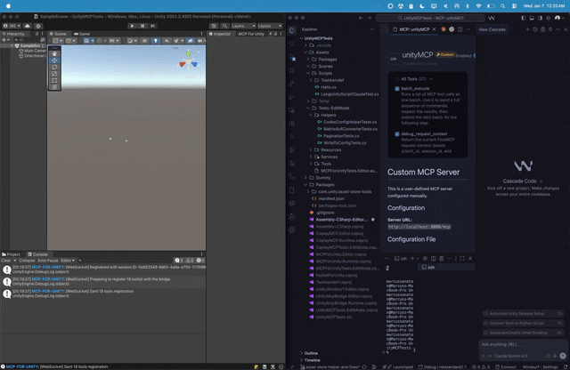

<p align="center">
  <picture>
    <source media="(prefers-color-scheme: dark)" srcset="../images/logo-header-dark.png">
    
  </picture>
</p>

<div align="center">

[English](../../README.md)  [简体中文](README-zh.md) &nbsp;&nbsp;&nbsp;|&nbsp;&nbsp;&nbsp; [Discord](https://discord.gg/y4p8KfzrN4)  [Wiki](https://coplaydev.github.io/unity-mcp/)

#### 由 [Aura](https://www.tryaura.dev/) 荣誉赞助并维护 —— 面向 Unreal 与 Unity 的 AI 助手。
##### 别错过 [Godot AI](https://github.com/hi-godot/godot-ai) 🤖，MCP for Unity 团队推出的全新开源项目！

</div>

<p align="center">MCP for Unity 通过 <a href="https://modelcontextprotocol.io/introduction">Model Context Protocol</a> 把 Claude、Cursor、VS Code、本地大模型等 AI 助手接入 Unity 编辑器，让它们直接帮你管理资源、搭场景、写脚本、跑测试，把开发流程里的重复活儿都包了。</p>

<p align="center">
  
</p>

---

<details>
<summary><strong>最近更新</strong></summary>

* **[v10.0.0](https://github.com/CoplayDev/unity-mcp/releases/tag/v10.0.0)**（2026-06-30）
* **[v9.7.3](https://github.com/CoplayDev/unity-mcp/releases/tag/v9.7.3)**（2026-06-15）
* **[v9.7.1](https://github.com/CoplayDev/unity-mcp/releases/tag/v9.7.1)**（2026-05-24）
* **[v9.7.0](https://github.com/CoplayDev/unity-mcp/releases/tag/v9.7.0)**（2026-05-22）
* **[v9.6.8](https://github.com/CoplayDev/unity-mcp/releases/tag/v9.6.8)**（2026-04-27）

完整更新历史见 [发布说明](https://coplaydev.github.io/unity-mcp/releases)。

</details>

---

## 它能做什么

用自然语言从任意 MCP 客户端操作 Unity 编辑器：搭场景、建 GameObject、写改 C# 脚本、调材质和着色器、跑测试、看性能、出包。47 个 MCP 工具入口，任意客户端可用，免费、MIT 开源。

**[查看完整工具目录 →](https://coplaydev.github.io/unity-mcp/reference/tools/)**

---

## 快速开始

**环境要求：** Unity **2021.3 LTS → 6.x** · Python **3.10+**（用 [`uv`](https://docs.astral.sh/uv/) 管理）。兼容**任意 MCP 客户端**——Claude Desktop 与 Claude Code、Cursor、VS Code、Windsurf、Cline、Gemini CLI 等等。

1. **安装** —— 在 Unity 里打开 Package Manager，从 git URL 添加：
   `https://github.com/CoplayDev/unity-mcp.git?path=/MCPForUnity#main` &nbsp;_（如需固定本次发布，可用 `#v10.0.0`；也可以用 `openupm add com.coplaydev.unity-mcp`）_
2. **配置客户端** —— `Window → MCP for Unity → Configure All Detected Clients`，一键搞定所有检测到的客户端。
3. **发个提示试试** —— *"在原点放一个立方体，加个 Rigidbody。"* 立方体几秒就出现在场景里了。

<details>
<summary><strong>手动配置</strong></summary>

如果自动配置不生效，把下面的内容加到你的 MCP 客户端配置文件里：

**HTTP（默认 —— 适用于 Claude Desktop、Cursor、Windsurf）：**
```json
{
  "mcpServers": {
    "unityMCP": {
      "url": "http://localhost:8080/mcp"
    }
  }
}
```

**VS Code：**
```json
{
  "servers": {
    "unityMCP": {
      "type": "http",
      "url": "http://localhost:8080/mcp"
    }
  }
}
```

<details>
<summary>Stdio 配置（uvx）</summary>

**macOS/Linux：**
```json
{
  "mcpServers": {
    "unityMCP": {
      "command": "uvx",
      "args": ["--from", "mcpforunityserver", "mcp-for-unity", "--transport", "stdio"]
    }
  }
}
```

**Windows：**
```json
{
  "mcpServers": {
    "unityMCP": {
      "command": "C:/Users/YOUR_USERNAME/AppData/Local/Microsoft/WinGet/Links/uvx.exe",
      "args": ["--from", "mcpforunityserver", "mcp-for-unity", "--transport", "stdio"]
    }
  }
}
```
</details>
</details>

---

<details>
<summary><strong>多个 Unity 实例</strong></summary>

MCP for Unity 支持同时开多个 Unity 编辑器实例。想把操作定向到某个实例：

1. 让大模型读一下 `unity_instances` 资源
2. 用 `set_active_instance` 传入 `Name@hash`（比如 `MyProject@abc123`）
3. 之后所有工具调用都会走这个实例
</details>

<details>
<summary><strong>Roslyn 脚本验证（进阶）</strong></summary>

想用能查出未定义命名空间、类型和方法的 **Strict** 验证：

1. 装 [NuGetForUnity](https://github.com/GlitchEnzo/NuGetForUnity)
2. `Window > NuGet Package Manager` → 安装 `Microsoft.CodeAnalysis` v5.0
3. 再装 `SQLitePCLRaw.core` 和 `SQLitePCLRaw.bundle_e_sqlite3` v3.0.2
4. 在 `Player Settings > Scripting Define Symbols` 里加上 `USE_ROSLYN`
5. 重启 Unity

  <details>
  <summary>手动安装 DLL（NuGetForUnity 用不了时）</summary>

  1. 从 [NuGet](https://www.nuget.org/packages/Microsoft.CodeAnalysis.CSharp/) 下载 `Microsoft.CodeAnalysis.CSharp.dll` 及其依赖
  2. 把 DLL 放进 `Assets/Plugins/`
  3. 确认 .NET 兼容性设置正确
  4. 在 Scripting Define Symbols 里加上 `USE_ROSLYN`
  5. 重启 Unity
  </details>
</details>

<details>
<summary><strong>故障排除</strong></summary>

* **Unity Bridge 连不上：** 看一下 `Window > MCP for Unity` 的状态，重启 Unity
* **服务器起不来：** 确认 `uv --version` 能跑，并看看终端报错
* **客户端连不上：** 确认 HTTP 服务在运行，且 URL 和你的配置一致

**详细配置指南：**
* [Fix Unity MCP and Cursor, VSCode & Windsurf](https://github.com/CoplayDev/unity-mcp/wiki/1.-Fix-Unity-MCP-and-Cursor,-VSCode-&-Windsurf) —— uv/Python 安装、PATH 问题
* [Fix Unity MCP and Claude Code](https://github.com/CoplayDev/unity-mcp/wiki/2.-Fix-Unity-MCP-and-Claude-Code) —— Claude CLI 安装
* [Common Setup Problems](https://github.com/CoplayDev/unity-mcp/wiki/3.-Common-Setup-Problems) —— macOS dyld 错误、常见问题

还是搞不定？[提个 Issue](https://github.com/CoplayDev/unity-mcp/issues) 或者 [来 Discord 问](https://discord.gg/y4p8KfzrN4)
</details>

<details>
<summary><strong>参与贡献</strong></summary>

开发环境配置见 [README-DEV.md](../development/README-DEV.md)，自定义工具见 [CUSTOM_TOOLS.md](../reference/CUSTOM_TOOLS.md)。

1. Fork → 开 issue → 建分支（`feature/your-idea`）→ 改 → 提 PR
</details>

<details>
<summary><strong>遥测与隐私</strong></summary>

匿名、注重隐私的遥测（不收集代码、项目名或任何个人数据），用 `DISABLE_TELEMETRY=true` 就能关掉。详见 [TELEMETRY.md](../reference/TELEMETRY.md)。
</details>

---

**许可证：** MIT —— 见 [LICENSE](../../LICENSE) | **需要帮助？** [Discord](https://discord.gg/y4p8KfzrN4) | [Issues](https://github.com/CoplayDev/unity-mcp/issues)

---

## Star 历史

[](https://www.star-history.com/#CoplayDev/unity-mcp&Date)

<details>
<summary><strong>论文引用</strong></summary>
如果 MCP for Unity 对你的研究有帮助，欢迎引用我们！

```bibtex
@inproceedings{10.1145/3757376.3771417,
author = {Wu, Shutong and Barnett, Justin P.},
title = {MCP-Unity: Protocol-Driven Framework for Interactive 3D Authoring},
year = {2025},
isbn = {9798400721366},
publisher = {Association for Computing Machinery},
address = {New York, NY, USA},
url = {https://doi.org/10.1145/3757376.3771417},
doi = {10.1145/3757376.3771417},
series = {SA Technical Communications '25}
}
```
</details>

## Aura 的 Unity AI 工具

Aura 出品两款 Unity AI 工具：
- **MCP for Unity** —— MIT 许可证，免费开源。
- **Aura for Unity** —— 面向游戏开发者的高级 Unity/Unreal AI 助手。

## 免责声明

本项目是一个免费开源的 Unity 编辑器工具，与 Unity Technologies 无关。
